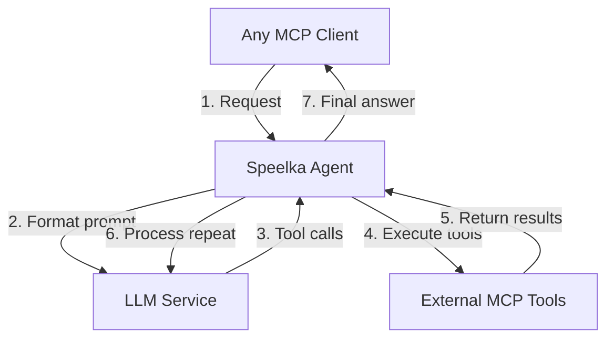

# Speelka Agent

Speelka Agent is a universal LLM agent based on the Model Context Protocol (MCP), providing tool execution capabilities through a Go-based implementation.



## Key Features

- **Precise Agent Definition**: Define detailed agent behavior through prompt engineering
- **Client-Side Context Optimization**: Reduce context size on the client side for more efficient token usage
- **LLM Flexibility**: Use different LLM providers between client and agent sides
- **Centralized Tool Management**: Single point of control for all available tools
- **Multiple Integration Options**: Support for MCP stdio, MCP HTTP, and Simple HTTP API
- **Built-in Reliability**: Retry mechanisms for handling transient failures
- **Extensibility**: System behavior extensions without client-side changes
- **MCP-Aware Logging**: Structured logging with MCP notifications

## Getting Started

### Prerequisites

- Go 1.19 or higher
- LLM API credentials (OpenAI or Anthropic)
- External MCP tools (optional)

### Installation

```bash
git clone https://github.com/korchasa/speelka-agent.git
cd speelka-agent
go build ./cmd/speelka-agent
```

### Configuration

Configuration is provided through environment variables. All environment variables are prefixed with `SPL_`:

| Environment Variable | Default Value | Description |
|---------------------|---------------|-------------|
| **Agent Configuration** | | |
| `SPL_AGENT_NAME` | *Required* | Name of the agent |
| `SPL_AGENT_VERSION` | "1.0.0" | Version of the agent |
| **Tool Configuration** | | |
| `SPL_TOOL_NAME` | *Required* | Name of the tool provided by the agent |
| `SPL_TOOL_DESCRIPTION` | *Required* | Description of the tool functionality |
| `SPL_TOOL_ARGUMENT_NAME` | *Required* | Name of the argument for the tool |
| `SPL_TOOL_ARGUMENT_DESCRIPTION` | *Required* | Description of the argument for the tool |
| **LLM Configuration** | | |
| `SPL_LLM_PROVIDER` | *Required* | Provider of LLM service (e.g., "openai", "anthropic") |
| `SPL_LLM_API_KEY` | *Required* | API key for the LLM provider |
| `SPL_LLM_MODEL` | *Required* | Model name (e.g., "gpt-4o", "claude-3-opus-20240229") |
| `SPL_LLM_MAX_TOKENS` | 0 | Maximum tokens to generate (0 means no limit) |
| `SPL_LLM_TEMPERATURE` | 0.7 | Temperature parameter for randomness in generation |
| `SPL_LLM_PROMPT_TEMPLATE` | *Required* | Template for system prompts (must include placeholder matching the `SPL_TOOL_ARGUMENT_NAME` value and `{{tools}}`) |
| **LLM Retry Configuration** | | |
| `SPL_LLM_RETRY_MAX_RETRIES` | 3 | Maximum number of retry attempts for LLM API calls |
| `SPL_LLM_RETRY_INITIAL_BACKOFF` | 1.0 | Initial backoff time in seconds |
| `SPL_LLM_RETRY_MAX_BACKOFF` | 30.0 | Maximum backoff time in seconds |
| `SPL_LLM_RETRY_BACKOFF_MULTIPLIER` | 2.0 | Multiplier for increasing backoff time |
| **MCP Servers Configuration** | | |
| `SPL_MCPS_0_ID` | "" | Identifier for the first MCP server |
| `SPL_MCPS_0_COMMAND` | "" | Command to execute for the first server |
| `SPL_MCPS_0_ARGS` | "" | Command arguments as space-separated string |
| `SPL_MCPS_0_ENV_*` | "" | Environment variables for the server (prefix with `SPL_MCPS_0_ENV_`) |
| `SPL_MCPS_1_ID`, etc. | "" | Configuration for additional servers (increment index) |
| **MCP Retry Configuration** | | |
| `SPL_MSPS_RETRY_MAX_RETRIES` | 3 | Maximum number of retry attempts for MCP server connections |
| `SPL_MSPS_RETRY_INITIAL_BACKOFF` | 1.0 | Initial backoff time in seconds |
| `SPL_MSPS_RETRY_MAX_BACKOFF` | 30.0 | Maximum backoff time in seconds |
| `SPL_MSPS_RETRY_BACKOFF_MULTIPLIER` | 2.0 | Multiplier for increasing backoff time |
| **Runtime Configuration** | | |
| `SPL_LOG_LEVEL` | "info" | Log level (debug, info, warn, error) |
| `SPL_LOG_OUTPUT` | "stderr" | Log output destination (stdout, stderr, file path) |
| `SPL_RUNTIME_STDIO_ENABLED` | true | Enable stdin/stdout transport |
| `SPL_RUNTIME_STDIO_BUFFER_SIZE` | 8192 | Buffer size for stdio transport |
| `SPL_RUNTIME_HTTP_ENABLED` | false | Enable HTTP transport |
| `SPL_RUNTIME_HTTP_HOST` | "localhost" | Host for HTTP server |
| `SPL_RUNTIME_HTTP_PORT` | 3000 | Port for HTTP server |

> **Note**: For backward compatibility, the system also accepts environment variables without the `SPL_` prefix, but this behavior may be removed in future versions.

Example configuration files are available in the `examples` directory:
- `examples/simple.env`: Basic agent configuration
- `examples/architect.env`: Software architecture analysis agent

#### Basic Configuration Example

```bash
# Required configuration
export SPL_AGENT_NAME="speelka-agent"
export SPL_TOOL_NAME="process"
export SPL_TOOL_DESCRIPTION="Process user queries with LLM"
export SPL_TOOL_ARGUMENT_NAME="input"
export SPL_TOOL_ARGUMENT_DESCRIPTION="The user query to process"
export SPL_LLM_PROVIDER="openai"
export SPL_LLM_API_KEY="your_api_key"
export SPL_LLM_MODEL="gpt-4o"
export SPL_LLM_PROMPT_TEMPLATE="You are a helpful AI assistant. User query: {{input}} Available tools: {{tools}}"
```

For more detailed information about configuration options, see [Environment Variables Reference](documents/knowledge.md#environment-variables-reference).

### Running the Agent

#### Daemon Mode (HTTP Server)

```bash
./speelka-agent --daemon
```

#### CLI Mode (Standard Input/Output)

```bash
./speelka-agent
```

## Usage Examples

### HTTP API

When running in daemon mode, the agent exposes HTTP endpoints:

```bash
# Send a request to the agent
curl -X POST http://localhost:3000/message -H "Content-Type: application/json" -d '{
  "method": "tools/call",
  "params": {
    "name": "process",
    "arguments": {
      "input": "Your query here"
    }
  }
}'
```

### External Tool Integration

Connect to external tools using the MCP protocol:

```bash
# MCP server for Playwright browser automation
export SPL_MCPS_0_ID="playwright"
export SPL_MCPS_0_COMMAND="mcp-playwright"
export SPL_MCPS_0_ARGS=""

# MCP server for filesystem operations
export SPL_MCPS_1_ID="filesystem"
export SPL_MCPS_1_COMMAND="mcp-filesystem-server"
export SPL_MCPS_1_ARGS="."
```

## Supported LLM Providers

- **OpenAI**: GPT-3.5, GPT-4, GPT-4o
- **Anthropic**: Claude models

## Documentation

For more detailed information, see:

- [System Architecture](documents/architecture.md)
- [Implementation Details](documents/implementation.md)
- [Project File Structure](documents/file_structure.md)
- [Reference Materials](documents/knowledge.md)
- [Future Development](documents/roadmap.md)

## Development

### Running Tests

```bash
go test ./...
```

### Helper Commands

The `run` script provides commands for common operations:

```bash
# Development
./run build        # Build the project
./run test         # Run tests with coverage
./run check        # Run all checks

# Interaction
./run call         # Test with simple query
./run complex-call # Test with complex query
```

See [Command Reference](documents/knowledge.md#command-reference) for more options.

## License

[MIT License](LICENSE)