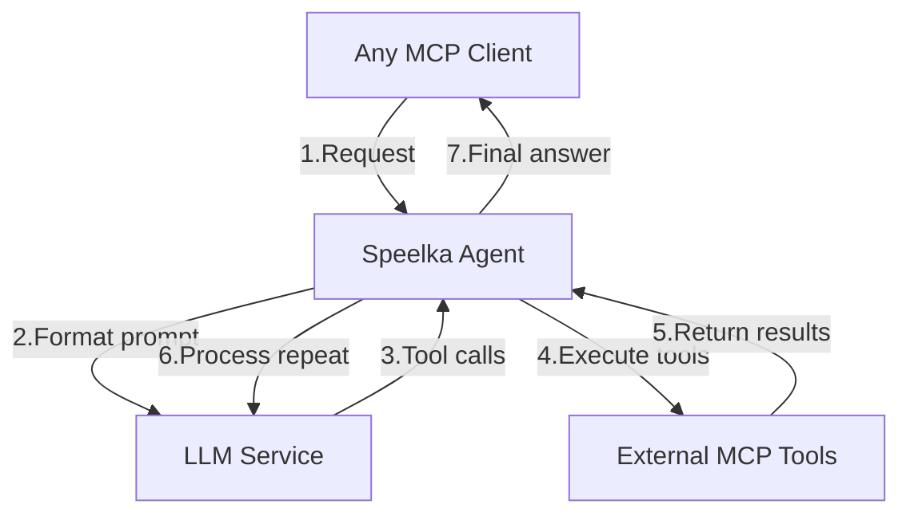

# Speelka Agent

Universal LLM agent based on the Model Context Protocol (MCP), with the ability to utilize tools from other MCP servers.



## Use Cases
- Improving accuracy by splitting large, complex instructions into specialized, focused tasks.
- Reducing cost by using different models to handle different parts of a task.
- Extending, narrowing down, or modifying the structure of third-party MCP server responses.
- Easily switching between "real" and LLM-based implementations of a given tool.
- Constraining capabilities by restricting the list of available tools in an MCP server.
- Orchestrating multi-step workflows across multiple MCP tools within a single agent session.
- Enforcing per-request token and cost budgets to ensure predictable usage.
- Automatic retry and exponential backoff handling for transient LLM or MCP server errors.
- Seamless provider switching between different LLM services (e.g., OpenAI, Anthropic) through unified configuration.

## Key Features

- **Precise Agent Definition**: Define detailed agent behavior through prompt engineering
- **Client-Side Context Optimization**: Reduce context size on the client side for more efficient token usage
- **LLM Flexibility**: Use different LLM providers between client and agent sides
- **Centralized Tool Management**: Single point of control for all available tools
- **Multiple Integration Options**: Support for MCP stdio, MCP HTTP, and Simple HTTP API
- **Built-in Reliability**: Retry mechanisms for handling transient failures
- **Extensibility**: System behavior extensions without client-side changes
- **MCP-Aware Logging**: Structured logging with MCP notifications
- **Token Management**: Automatic token counting
- **Flexible Configuration**: Support for environment variables, YAML, and JSON configuration files
- **LLMService.SendRequest** now returns an `LLMResponse` struct with:
  - Response text
  - List of tool calls
  - CompletionTokens, PromptTokens, ReasoningTokens, TotalTokens (token usage)
- **Interface**: `SendRequest(ctx, messages, tools) (LLMResponse, error)`

## Getting Started

### Prerequisites

- Go 1.19 or higher
- LLM API credentials (OpenAI or Anthropic)
- External MCP tools (optional)

### Installation

```bash
git clone https://github.com/korchasa/speelka-agent-go.git
cd speelka-agent-go
go build ./cmd/server
```

### Configuration

Configuration can be provided using YAML, JSON, or environment variables.

> **Note:** The `./examples` directory is deprecated and will be removed in a future version. Please use the examples in the `./site/examples` directory instead.

Example configuration files are available in the `site/examples` directory:
- `site/examples/minimal.yaml`: Basic agent configuration in YAML format
- `site/examples/ai-news.yaml`: AI news agent configuration in YAML format
- `site/examples/architect.yaml`: Architect agent configuration in YAML format

Here's a simple YAML configuration example:

```yaml
agent:
  name: "simple-speelka-agent"
  version: "1.0.0"

  # Tool configuration
  tool:
    name: "process"
    description: "Process tool for handling user queries with LLM"
    argument_name: "input"
    argument_description: "The user query to process"

  # LLM configuration
  llm:
    provider: "openai"
    api_key: ""  # Set via environment variable instead for security
    model: "gpt-4o"
    temperature: 0.7
    prompt_template: "You are a helpful AI assistant. Respond to the following request: {{input}}. Provide a detailed and helpful response. Available tools: {{tools}}"

  # Chat configuration
  chat:
    max_tokens: 0
    max_llm_iterations: 25
    request_budget: 0.0  # Maximum cost (USD or token-equivalent) per request (0 = unlimited)

  # MCP Server connections
  connections:
    mcpServers:
      time:
        command: "docker"
        args: ["run", "-i", "--rm", "mcp/time"]
        includeTools:
          - now
          - utc

      filesystem:
        command: "mcp-filesystem-server"
        args: ["/path/to/directory"]
        excludeTools:
          - delete

# Runtime configuration
runtime:
  log:
    level: "info"

  transports:
    stdio:
      enabled: true
```

#### Using Environment Variables

All environment variables are prefixed with `SPL_`:

| Environment Variable                | Default Value | Description                                                                                                        |
|-------------------------------------|---------------|--------------------------------------------------------------------------------------------------------------------|
| **Agent Configuration**             |               |                                                                                                                    |
| `SPL_AGENT_NAME`                    | *Required*    | Name of the agent                                                                                                  |
| `SPL_AGENT_VERSION`                 | "1.0.0"       | Version of the agent                                                                                               |
| **Tool Configuration**              |               |                                                                                                                    |
| `SPL_TOOL_NAME`                     | *Required*    | Name of the tool provided by the agent                                                                             |
| `SPL_TOOL_DESCRIPTION`              | *Required*    | Description of the tool functionality                                                                              |
| `SPL_TOOL_ARGUMENT_NAME`            | *Required*    | Name of the argument for the tool                                                                                  |
| `SPL_TOOL_ARGUMENT_DESCRIPTION`     | *Required*    | Description of the argument for the tool                                                                           |
| **LLM Configuration**               |               |                                                                                                                    |
| `SPL_LLM_PROVIDER`                  | *Required*    | Provider of LLM service (e.g., "openai", "anthropic")                                                              |
| `SPL_LLM_API_KEY`                   | *Required*    | API key for the LLM provider                                                                                       |
| `SPL_LLM_MODEL`                     | *Required*    | Model name (e.g., "gpt-4o", "claude-3-opus-20240229")                                                              |
| `SPL_LLM_MAX_TOKENS`                | 0             | Maximum tokens to generate (0 means no limit)                                                                      |
| `SPL_LLM_TEMPERATURE`               | 0.7           | Temperature parameter for randomness in generation                                                                 |
| `SPL_LLM_PROMPT_TEMPLATE`           | *Required*    | Template for system prompts (must include placeholder matching the `SPL_TOOL_ARGUMENT_NAME` value and `{{tools}}`) |
| **Chat Configuration**              |               |                                                                                                                    |
| `SPL_CHAT_MAX_ITERATIONS`           | 100           | Maximum number of LLM iterations                                                                                   |
| `SPL_CHAT_MAX_TOKENS`               | 0             | Maximum tokens in chat history (0 means based on model)                                                            |
| `SPL_CHAT_REQUEST_BUDGET`           | 1.0           | Maximum cost (USD or token-equivalent) per request (0 = unlimited)                                                 |
| **LLM Retry Configuration**         |               |                                                                                                                    |
| `SPL_LLM_RETRY_MAX_RETRIES`         | 3             | Maximum number of retry attempts for LLM API calls                                                                 |
| `SPL_LLM_RETRY_INITIAL_BACKOFF`     | 1.0           | Initial backoff time in seconds                                                                                    |
| `SPL_LLM_RETRY_MAX_BACKOFF`         | 30.0          | Maximum backoff time in seconds                                                                                    |
| `SPL_LLM_RETRY_BACKOFF_MULTIPLIER`  | 2.0           | Multiplier for increasing backoff time                                                                             |
| **MCP Servers Configuration**       |               |                                                                                                                    |
| `SPL_MCPS_0_ID`                     | ""            | Identifier for the first MCP server                                                                                |
| `SPL_MCPS_0_COMMAND`                | ""            | Command to execute for the first server                                                                            |
| `SPL_MCPS_0_ARGS`                   | ""            | Command arguments as space-separated string                                                                        |
| `SPL_MCPS_0_ENV_*`                  | ""            | Environment variables for the server (prefix with `SPL_MCPS_0_ENV_`)                                               |
| `SPL_MCPS_1_ID`, etc.               | ""            | Configuration for additional servers (increment index)                                                             |
| **MCP Retry Configuration**         |               |                                                                                                                    |
| `SPL_MSPS_RETRY_MAX_RETRIES`        | 3             | Maximum number of retry attempts for MCP server connections                                                        |
| `SPL_MSPS_RETRY_INITIAL_BACKOFF`    | 1.0           | Initial backoff time in seconds                                                                                    |
| `SPL_MSPS_RETRY_MAX_BACKOFF`        | 30.0          | Maximum backoff time in seconds                                                                                    |
| `SPL_MSPS_RETRY_BACKOFF_MULTIPLIER` | 2.0           | Multiplier for increasing backoff time                                                                             |
| **Runtime Configuration**           |               |                                                                                                                    |
| `SPL_LOG_LEVEL`                     | "info"        | Log level (debug, info, warn, error)                                                                               |
| `SPL_LOG_OUTPUT`                    | "stderr"      | Log output destination (stdout, stderr, file path)                                                                 |
| `SPL_RUNTIME_STDIO_ENABLED`         | true          | Enable stdin/stdout transport                                                                                      |
| `SPL_RUNTIME_STDIO_BUFFER_SIZE`     | 8192          | Buffer size for stdio transport                                                                                    |
| `SPL_RUNTIME_HTTP_ENABLED`          | false         | Enable HTTP transport                                                                                              |
| `SPL_RUNTIME_HTTP_HOST`             | "localhost"   | Host for HTTP server                                                                                               |
| `SPL_RUNTIME_HTTP_PORT`             | 3000          | Port for HTTP server                                                                                               |

For more detailed information about configuration options, see [Environment Variables Reference](documents/knowledge.md#environment-variables-reference).

### Running the Agent

#### Daemon Mode (HTTP Server)

```bash
./speelka-agent --daemon [--config config.yaml]
```

#### CLI Mode (Standard Input/Output)

```bash
./speelka-agent [--config config.yaml]
```

## Usage Examples

### HTTP API

When running in daemon mode, the agent exposes HTTP endpoints:

```bash
# Send a request to the agent
curl -X POST http://localhost:3000/message -H "Content-Type: application/json" -d '{
  "method": "tools/call",
  "params": {
    "name": "process",
    "arguments": {
      "input": "Your query here"
    }
  }
}'
```

### External Tool Integration

Connect to external tools using the MCP protocol in your YAML configuration:

```yaml
agent:
  # ... other agent configuration ...
  connections:
    mcpServers:
      # MCP server for Playwright browser automation
      playwright:
        command: "mcp-playwright"
        args: []

      # MCP server for filesystem operations
      filesystem:
        command: "mcp-filesystem-server"
        args: ["."]
```

Or using environment variables:

```bash
# MCP server for Playwright browser automation
export SPL_MCPS_0_ID="playwright"
export SPL_MCPS_0_COMMAND="mcp-playwright"
export SPL_MCPS_0_ARGS=""

# MCP server for filesystem operations
export SPL_MCPS_1_ID="filesystem"
export SPL_MCPS_1_COMMAND="mcp-filesystem-server"
export SPL_MCPS_1_ARGS="."
```

## Supported LLM Providers

- **OpenAI**: GPT-3.5, GPT-4, GPT-4o
- **Anthropic**: Claude models

## Documentation

For more detailed information, see:

- [System Architecture](documents/architecture.md)
- [Implementation Details](documents/implementation.md)
- [Project File Structure](documents/file_structure.md)
- [Reference Materials](documents/knowledge.md)
- [External Resources](documents/remote_resources.md)

## Development

### Running Tests

```bash
go test ./...
```

### Helper Commands

The `run` script provides commands for common operations:

```bash
# Development
./run build        # Build the project
./run test         # Run tests with coverage
./run check        # Run all checks
./run lint         # Run linter

# Interaction
./run call         # Test with simple query
./run call-multistep # Test with multi-step query
./run call-news    # Test news agent
./run fetch_url    # Fetch a URL using MCP

# Inspection
./run inspect      # Run with MCP inspector
```

See [Command Reference](documents/knowledge.md#command-reference) for more options.

## License

[MIT License](LICENSE)

### MCP Server Tool Filtering

You can control which tools are exported from each MCP server using the following options in the `mcpServers` section:

- `includeTools`: (optional) List of tool names to include. Only these tools will be available from the server.
- `excludeTools`: (optional) List of tool names to exclude. These tools will not be available from the server.
- If both are set, `includeTools` is applied first, then `excludeTools`.
- Tool names are case-sensitive.

Example:
```yaml
connections:
  mcpServers:
    time:
      command: "docker"
      args: ["run", "-i", "--rm", "mcp/time"]
      includeTools:
        - now
        - utc
    filesystem:
      command: "mcp-filesystem-server"
      args: ["/path/to/directory"]
      excludeTools:
        - delete
```