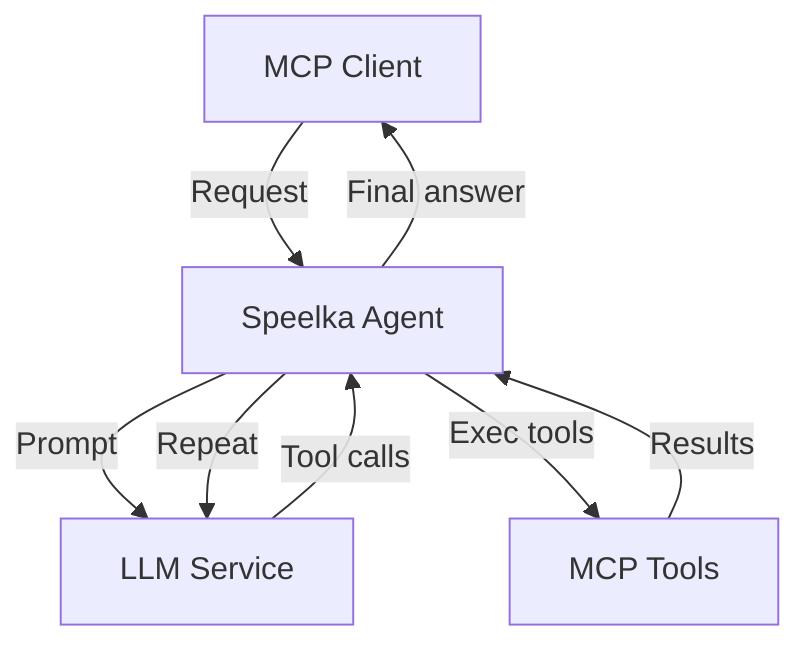
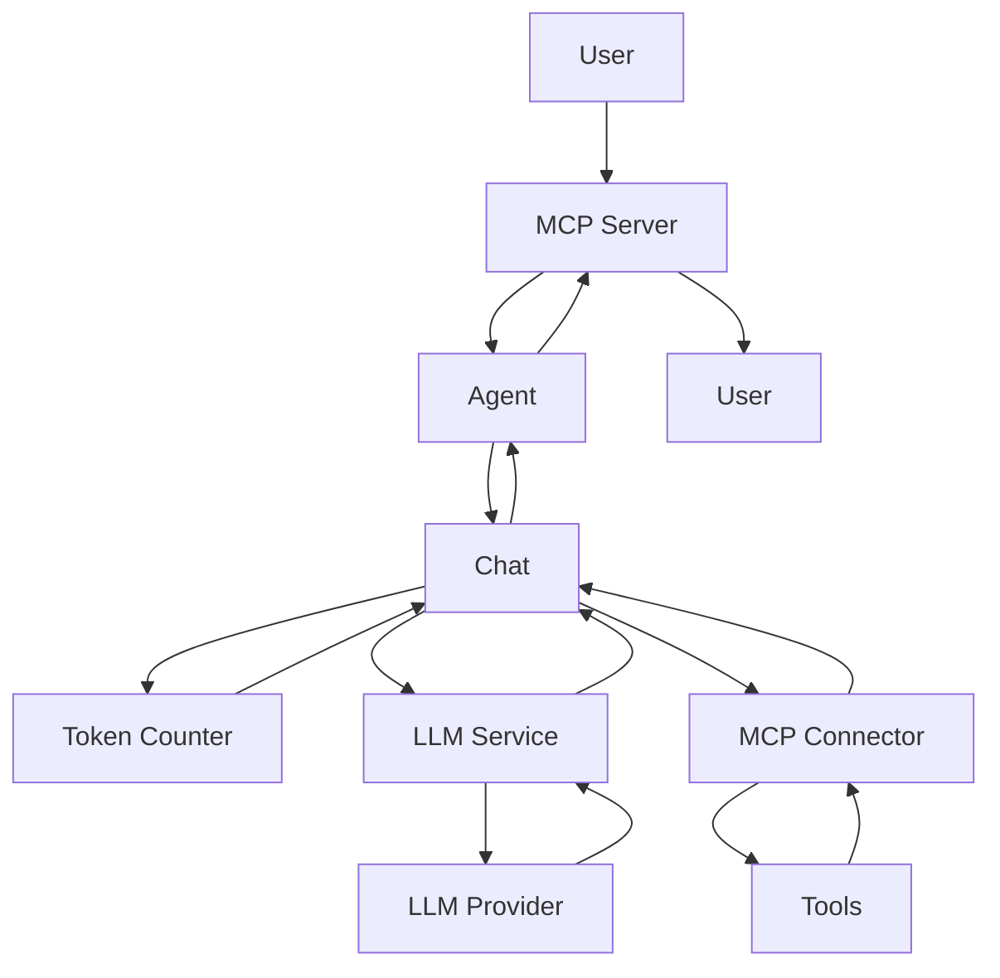
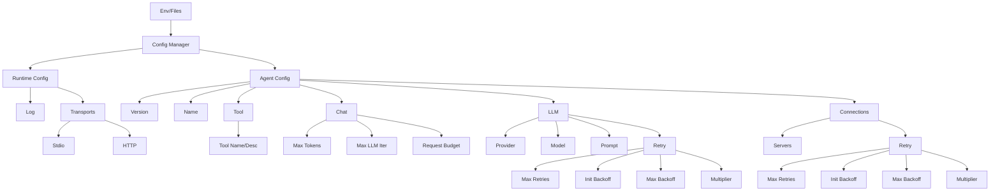

# System Architecture

## Overview
The system has been simplified by removing all interface/spec files from `internal/types/`. The codebase now favors direct, concrete implementations over abstract interfaces, reducing indirection and improving maintainability.

## Key Changes
- **Removed:** All interface/spec files for LLM, logger, MCP server, metrics, and connectors.
- **Removed:** Utility functions for dumping, time, and JSON (`internal/utils/dump.go`).
- **Updated:** The `run` script now has clearer test output, improved Russian text checks, and updated integration/emulation test prompts.
- **Updated:** Example config (`site/examples/minimal.yaml`) now uses `npx fetcher-mcp` for the `filesystem` tool and omits the `disableMcp` log config.

## Design Patterns
- **Direct Implementation:** The system now uses direct struct and function implementations, reducing the need for interface-based abstraction unless required for testing or extensibility.
- **Testing:** All tests for removed interfaces and utilities have been deleted. Testing now focuses on concrete behavior.

## Error Handling
- Error handling remains robust, but is now implemented directly in business logic rather than via interface contracts.

## Testing Strategy
- Tests are now written for concrete types and functions only. No interface-based mocks remain.

## Principles
- Single-responsibility components
- Dependency injection
- Interface-based design
- Centralized configuration
- Structured error handling
- Secure by default

## High-Level Flow

## Main Components
- **Agent** (`internal/agent`): Orchestrates LLM loop, tool execution, and chat state. Exposes a clean interface for the app layer. No config/server/CLI logic.
- **App Layer** (`internal/app_*`): Application wiring, lifecycle, CLI/server entrypoints. Manages config, logger, MCP server, agent instance.
    - `app_mcp`: MCP server/daemon mode (uses NewAgentServerMode, DispatchMCPCall)
    - `app_direct`: CLI mode (implements NewAgentCLI, fully independent from app_mcp)
- **Config Manager**: Loads and validates config (env, YAML, JSON), provides typed access.
- **LLM Service**: Handles LLM requests, retry logic, returns structured responses.
- **MCP Server**: Exposes agent via HTTP/stdio, manages tools, processes requests.
- **MCP Connector**: Connects to external MCP servers, routes tool calls, manages timeouts.
- **Chat**: Manages history, formatting, token/cost tracking, enforces request budget.
- **Logger**: Centralized logging (logrus/MCP protocol), client notifications, flexible output and format.

## Data Flow
1. User → MCP Server
2. Agent → Chat session
3. LLM Service (prompt + tools)
4. LLM → text/tool calls
5. MCP Connector → tool exec
6. Tool results → Chat
7. Token/cost check
8. Repeat until answer
9. Response → User

## Error Handling
- Categories: Validation, Transient, Internal, External
- Retry per error type
- Context-rich, sanitized messages
- No panics, always check nil
- Orphaned tool calls are auto-removed and logged

## Security
- API keys via env/secure storage
- Sanitized logs/errors
- HTTP transport security
- Tool access control

## Transports
- Daemon: HTTP server
- CLI: stdio (direct call mode)

## Dependencies
- `mcp-go`: MCP protocol
- `langchaingo`: LLM abstraction
- `logrus`: Logging
- `koanf` (core + providers/parsers): Configuration management (file, env, confmap, structs, json, yaml, toml, etc.)

## Configuration
- Flexible: YAML, JSON, env
- Type-safe, validated, secure
- Load order: default → file → env
- All configuration loading, merging, and env parsing is now handled by koanf (core + providers), following official best practices. No custom loaders remain (DefaultLoader, EnvLoader, YAML/JSONLoader are removed).
- All config structs use `koanf` tags for field mapping; `json`/`yaml` tags are removed.
- **LogConfig**: Centralized log configuration with support for output (stdout, stderr, file, MCP), format (custom, json, text, unknown), and dynamic log level.
- **Log Output Constants**: `LogOutputStdout`, `LogOutputStderr`, `LogOutputMCP` for unified output selection.

## Logging
- Centralized logger (logrus/MCP)
- Dynamic log level and format via config
- Output: stdout, stderr, file, or MCP protocol
- No log duplication
- No secrets/PII in logs
- **LoggerSpec**: extended logger interface with SetFormatter, SetMCPServer (via MCPServerNotifier)
- **MCPServerNotifier**: interface for sending MCP notifications from the logger

## Configuration Overlay & Serialization
- Property-based overlay tests: verify correct config overlay (edge-cases, map merge, zero-value preservation)
- Golden serialization tests: control config structure compatibility by comparing with a golden file
- See tests in `internal/types/configuration_test.go`

## Diagrams and Structure
### Request Flow

### Config Structure

## Direct Call Mode
- `--call` flag: single-shot agent run, outputs structured JSON to stdout
- All errors mapped to JSON and exit codes (0: success, 1: user/config, 2: internal/tool)
- Use cases: scripting, automation, CI
- **app_direct** implements NewAgentCLI using real MCP connector to discover external tools

## Log Routing Logic
- After initializing a connection to an MCP server (ConnectServer), the connector saves the server's capabilities.
- If capabilities.Logging is present:
    - For stdio servers: subscribe to notifications/message via OnNotification, route logs to the main logger.
    - For HTTP servers: (similarly, via SSE, if implemented).
- If capabilities.Logging is absent:
    - For stdio servers: fallback — a separate goroutine reads stderr of the child process and forwards lines to the main logger.
    - For HTTP fallback is not implemented (stderr cannot be accessed).
- All log routes are managed via LogConfig and support dynamic format and level changes.

## Implementation Location
- internal/mcp_connector/connection.go — MCP client connection and initialization logic
- internal/mcp_connector/logging.go — log routing (MCP logs or fallback to stderr)
- internal/types/logger_spec.go — LogConfig, LoggerSpec, MCPServerNotifier interfaces
- internal/app_direct/app.go — CLI mode, uses NewAgentCLI with real MCP connector

## Testing
- Capabilities are saved after initialize
- Log routing (MCP and fallback) is tested
- Overlay and config serialization are tested
- All changes are covered by unit tests

## Patterns and Principles
- Feature toggle (capabilities as a flag)
- Dependency injection for logger
- Unit tests for all new functions

# MCPServer Architecture

## Thread Safety
MCPServer uses sync.Mutex to protect state for all public methods related to the server lifecycle and notification sending. This ensures correct operation under concurrent Serve, Stop, BroadcastNotification, and other method calls.
All external dependencies (logger, configuration, internal MCP server, SSE server) are injected via the constructor or can be explicitly replaced for testing. This provides high testability and modularity.

## Error Handling
- All errors when sending notifications (BroadcastNotification) are logged but do not interrupt the main execution flow.
- Lifecycle-related methods return errors for proper handling at the application level.

## Public Method Contracts of MCPServer
- Serve(ctx, daemonMode, handler): Starts the server in the required mode, thread-safe.
- Stop(ctx): Gracefully shuts down the server, releases resources, thread-safe.
- SendNotificationToClient(ctx, method, data): Sends a notification to a single client, returns an error on failure.
- GetAllTools(): Returns all registered tools.
- GetServer(): Returns the internal *server.MCPServer for integration and tests.

## Features
- Tools are created uniformly via buildTools.
- exitTool (the tool for the final user answer) is built based on MCPServerConfig.Tool (name, description, argument, argument description), not hardcoded.
- For tests, a notificationBroadcaster interface is provided, allowing mocking of notification sending and error handling.
