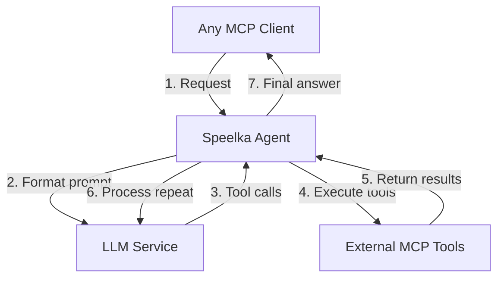
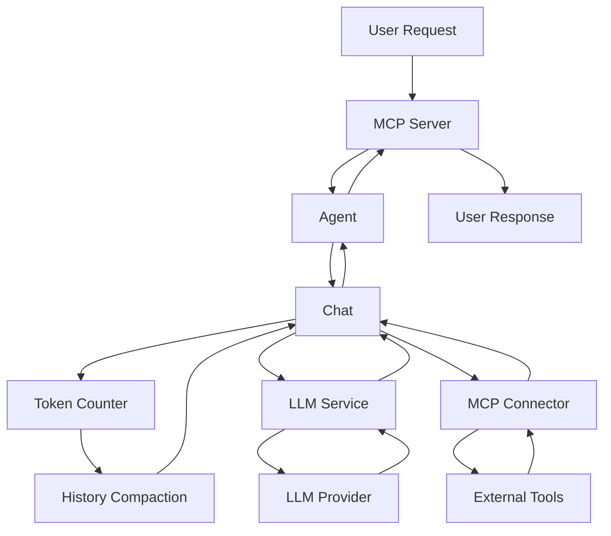
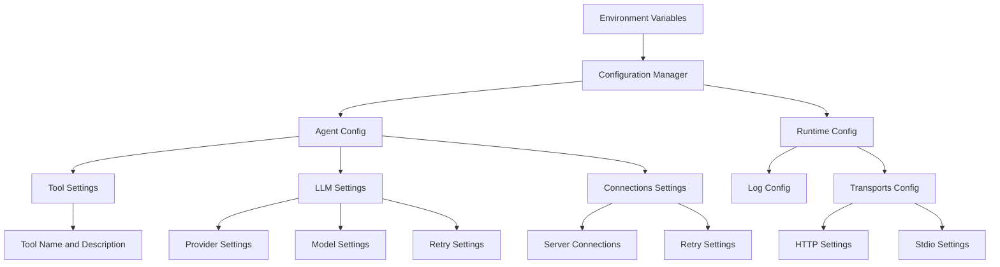

# System Architecture

## Overview
Speelka Agent is a universal LLM agent based on Model Context Protocol (MCP), providing a modular, extensible system with clean architecture.

## Core Design Principles
1. **Separation of Concerns**: Each component has a single responsibility
2. **Dependency Injection**: Dependencies are provided via constructors
3. **Interface-Based Design**: Components implement interfaces for testability
4. **Error Handling Strategy**: Structured, categorized error handling
5. **Configuration Management**: Centralized configuration with component-specific subsets

## High-Level Architecture

## Key Components

### Agent
- Central orchestrator coordinating all components
- Manages conversation flow between user, LLM, and tools
- Processes user requests via MCP server
- Controls LLM interaction loop
- Delegates tool execution to MCP connector
- Maintains conversation state via Chat component

### Configuration Manager
- Centralized configuration access point
- Loads configuration from environment variables or files
- Provides typed access to configuration subsets
- Implements `ConfigurationManagerSpec` interface

### LLM Service
- Handles communication with LLM providers
- Supports multiple providers (OpenAI, Anthropic)
- Formats and sends requests to LLMs
- Processes responses and extracts tool calls
- Implements retry logic for transient errors

### MCP Server
- Exposes agent functionality to clients
- Supports HTTP and stdio protocols
- Registers and manages available tools
- Processes incoming requests
- Returns responses to clients

### MCP Connector
- Connects to external MCP servers for tool execution
- Manages connections to multiple MCP servers
- Discovers available tools from connected servers
- Routes tool calls to appropriate servers
- Returns tool execution results

### Chat
- Manages conversation history and formatting
- Maintains message history between user, assistant, and tools
- Formats prompts with templates
- Provides conversation context for LLM requests
- Tracks tool calls and results
- Implements token counting and history compaction
- Supports multiple compaction strategies to reduce context size
- Ensures conversations remain within LLM token limits

### MCPLogger
- Wraps logrus logging library with MCP capabilities
- Supports standard logging and MCP protocol-based logging to clients
- Maps between logrus levels and MCP protocol levels
- Sends "notifications/message" to connected clients
- Provides "logging/setLevel" tool for clients

## System Diagrams

### Request Flow Diagram

### Configuration Structure

## Data Flow
1. User request → MCP Server
2. Agent processes request, initializes Chat session
3. LLM Service called with formatted prompt + available tools
4. LLM responds with text and/or tool calls
5. For each tool call, MCP Connector executes tool on appropriate server
6. Tool results added to Chat history
7. Token count checked and compaction applied if needed
8. Process repeats until LLM issues "answer" command
9. Final response returned to user via MCP Server

## Error Handling Philosophy
- **Categories**: Validation, Transient, Internal, External
- **Retry Strategies**: Appropriate mechanisms per error type
- **Context-rich messages**: Including relevant information without sensitive data
- **Graceful degradation**: System remains functional when components fail

### Error Handling Principles
1. **Always Check for Nil**: Before type assertions on interface values
2. **Safe Type Assertions**: Use two-return form
3. **Descriptive Error Messages**: Include expected vs actual type
4. **Return Graceful Errors**: Clear errors instead of panics

## Security Considerations
- API keys stored in environment variables or secure storage
- Sensitive information sanitized in errors and logs
- Transport security options for HTTP connections
- Access control for tool execution

## Multi-Transport Support
- **Daemon mode**: HTTP server for multi-client support
- **CLI mode**: Stdin/stdout for command-line usage

## External Dependencies
- `mcp-go`: Go implementation of Model Context Protocol
- `langchaingo`: Go client for LLM interaction
- `logrus`: Structured logging
- Standard Go libraries
