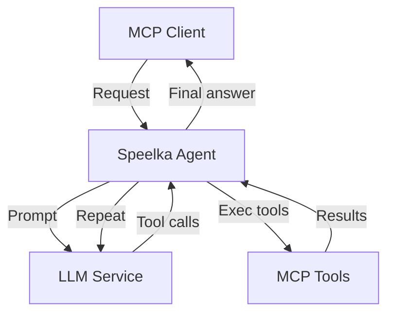
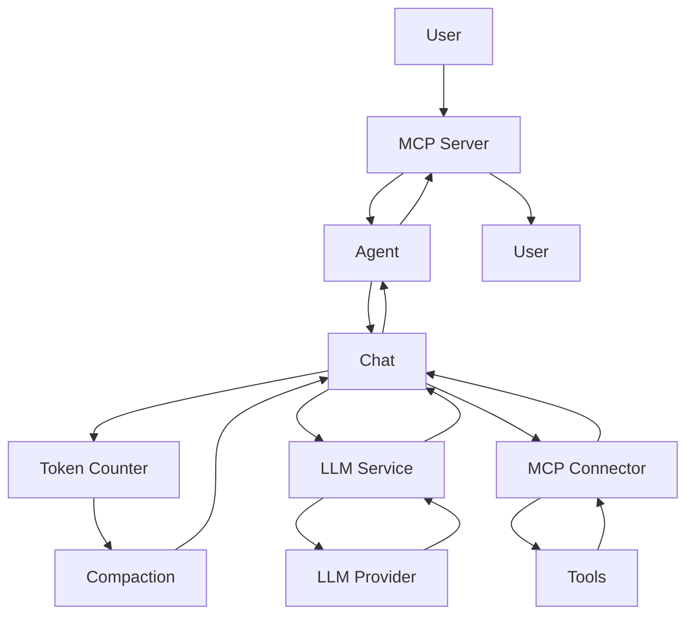
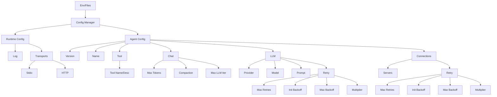

# System Architecture

## Overview
- Universal LLM agent (MCP-based)
- Modular, extensible, clean architecture

## Principles
- Single-responsibility components
- Dependency injection
- Interface-driven, testable
- Structured error handling
- Centralized config

## High-Level Flow

## Components
- **Agent**: Orchestrates flow, manages state, LLM loop, tool exec, chat state (token/cost tracked via LLMResponse, fallback estimation if needed)
- **Config Manager**: Loads/validates config (env, YAML, JSON), provides typed access, matches `types.Configuration` structure
- **LLM Service**: Handles LLM requests, retry logic, returns `LLMResponse` (text, tool calls, token/cost)
- **MCP Server**: Exposes agent (HTTP, stdio), manages tools, processes requests
- **MCP Connector**: Connects to external MCP servers, routes tool calls, manages connections
- **Chat**: Manages history, formatting, compaction, token/cost, context, all state in `chatInfo` struct, immutable config
- **Logger**: Wraps logrus, MCP protocol logging, client notifications

## Data Flow
1. User → MCP Server
2. Agent → Chat session
3. LLM Service (prompt + tools)
4. LLM → text/tool calls
5. MCP Connector → tool exec
6. Tool results → Chat
7. Token check/compaction
8. Repeat until answer
9. Response → User

## Error Handling
- Categories: Validation, Transient, Internal, External
- Retry: Per error type
- Context-rich, sanitized messages
- Graceful degradation
- Principles: Always check nil, safe assertions, descriptive errors, no panics

## Security
- API keys: env/secure storage
- Sanitized logs/errors
- HTTP transport security
- Tool access control

## Multi-Transport
- Daemon: HTTP server
- CLI: stdio

## Dependencies
- `mcp-go`: MCP impl
- `langchaingo`: LLM client
- `logrus`: Logging

## Config System
- Flexible: YAML, JSON, env
- Type-safe, validated, defaults
- Secure: API keys via env
- Only `Apply` parses log level/output
- Load order: default → file → env

## Testing
- Unit: 75%+ coverage, mocks
- Config: defaults, overrides, validation, transport
- Integration: component, config, API
- E2E: agent, transport, tools, token/cost/approximation

## Diagrams
### Request Flow

### Config Structure

