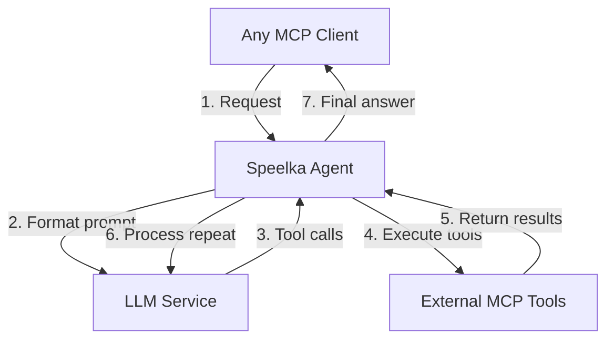
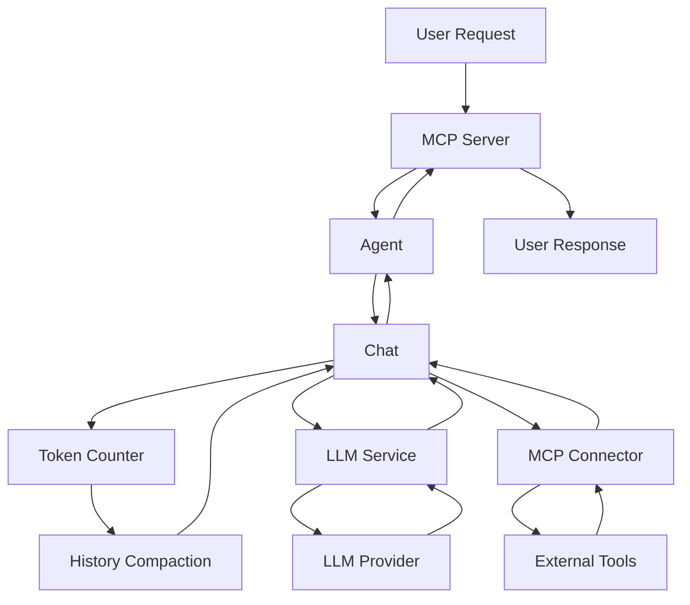
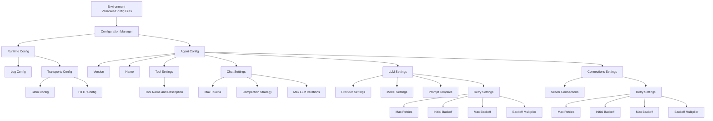

# System Architecture

## Overview
Speelka Agent is a universal LLM agent based on Model Context Protocol (MCP), providing a modular, extensible system with clean architecture.

## Core Design Principles
1. **Separation of Concerns**: Each component has a single responsibility
2. **Dependency Injection**: Dependencies are provided via constructors
3. **Interface-Based Design**: Components implement interfaces for testability
4. **Error Handling Strategy**: Structured, categorized error handling
5. **Configuration Management**: Centralized configuration with component-specific subsets

## High-Level Architecture

## Key Components

### Agent
- Central orchestrator coordinating all components
- Manages conversation flow between user, LLM, and tools
- Processes user requests via MCP server
- Controls LLM interaction loop
- Delegates tool execution to MCP connector
- Maintains conversation state via the Chat component, which stores LLMResponse objects for assistant messages and uses exact token counts from LLMResponseTokensMetadata by default, falling back to estimation only if necessary. Chat provides GetTotalTokens and GetTotalCost methods, both returning a value and an approximation flag. AddAssistantMessage precomputes and stores total tokens and cost, using a calculator if set, and falls back to estimation (character count divided by 4) if token metadata is missing, setting the approximation flag accordingly.

### Configuration Manager
- Centralized configuration access point
- Loads configuration from environment variables or files
- Provides typed access to configuration subsets
- Implements `ConfigurationManagerSpec` interface
- Log configuration flow: All configuration loaders (DefaultLoader, EnvLoader, YAMLLoader, JSONLoader) set only `RawLevel` and `RawOutput` as strings. The `Apply` method of `types.Configuration` is solely responsible for parsing these fields into `LogLevel` and `Output`.

### LLM Service
- Handles communication with LLM providers
- Supports multiple providers (OpenAI, Anthropic)
- Formats and sends requests to LLMs
- Processes responses and extracts tool calls
- Implements retry logic for transient errors
- Returns: `LLMResponse` struct (response text, tool calls, token usage: CompletionTokens, PromptTokens, ReasoningTokens, TotalTokens, and the original messages array as `LLMResponses`).
- Interface: `SendRequest(ctx, messages, tools) (LLMResponse, error)`
- Token usage and cost are available to the agent for advanced budgeting and analytics.

### MCP Server
- Exposes agent functionality to clients
- Supports HTTP and stdio protocols
- Registers and manages available tools
- Processes incoming requests
- Returns responses to clients

### MCP Connector
- Connects to external MCP servers for tool execution
- Manages connections to multiple MCP servers
- Discovers available tools from connected servers
- Routes tool calls to appropriate servers
- Returns tool execution results

### Chat
- Manages conversation history and formatting
- Maintains message history between user, assistant, and tools
- Formats prompts with templates
- Provides conversation context for LLM requests
- Tracks tool calls and results
- Implements token counting, cost calculation, and history compaction
- All chat state is managed via a single `chatInfo` struct (type `types.ChatInfo`), updated on every state change. Fields: `TotalTokens`, `TotalCost`, `IsApproximate`, `MaxTokens`, `MessageStackLen`, `LLMRequests`, `ModelName`, `ToolCallCount`, `LastMessageTime`, `SystemPrompt`.
- All mutating methods update `chatInfo`. `GetInfo()` returns a copy of `chatInfo`.
- Tests verify all fields in `ChatInfo`, including model name, tool call count, last message time, and system prompt.
- Token counting (totalTokens, totalCost, isApproximate) is based only on llmResponses (assistant messages), not on messageStack.
- Uses LLMResponseTokensMetadata for token counting by default, falling back to a centralized estimation utility if those fields are empty. Cost is calculated using a calculator if set, otherwise zero, and the approximation flag is set if fallback is used.
- Supports multiple compaction strategies to reduce context size
- Ensures conversations remain within LLM token limits
- The Chat component is configured entirely via its constructor. All runtime configuration (such as maxTokens and compactionStrategy) must be provided at instantiation. There are no setter methods for these properties.

### MCPLogger
- Wraps logrus logging library with MCP capabilities
- Supports standard logging and MCP protocol-based logging to clients
- Maps between logrus levels and MCP protocol levels
- Sends "notifications/message" to connected clients
- Provides "logging/setLevel" tool for clients

## System Diagrams

### Request Flow Diagram

### Configuration Structure

## Data Flow
1. User request → MCP Server
2. Agent processes request, initializes Chat session
3. LLM Service called with formatted prompt + available tools
4. LLM responds with text and/or tool calls
5. For each tool call, MCP Connector executes tool on appropriate server
6. Tool results added to Chat history
7. Token count checked and compaction applied if needed
8. Process repeats until LLM issues "answer" command
9. Final response returned to user via MCP Server

## Error Handling Philosophy
- **Categories**: Validation, Transient, Internal, External
- **Retry Strategies**: Appropriate mechanisms per error type
- **Context-rich messages**: Including relevant information without sensitive data
- **Graceful degradation**: System remains functional when components fail

### Error Handling Principles
1. **Always Check for Nil**: Before type assertions on interface values
2. **Safe Type Assertions**: Use two-return form
3. **Descriptive Error Messages**: Include expected vs actual type
4. **Return Graceful Errors**: Clear errors instead of panics

## Security Considerations
- API keys stored in environment variables or secure storage
- Sensitive information sanitized in errors and logs
- Transport security options for HTTP connections
- Access control for tool execution

## Multi-Transport Support
- **Daemon mode**: HTTP server for multi-client support
- **CLI mode**: Stdin/stdout for command-line usage

## External Dependencies
- `mcp-go`: Go implementation of Model Context Protocol
- `langchaingo`: Go client for LLM interaction
- `logrus`: Structured logging
- Standard Go libraries

## Configuration System

### Core Principles
- **Flexibility**: Multiple ways to configure (YAML, JSON, env vars)
- **Type Safety**: Strong typing ensures configuration validation
- **Defaults**: Sensible defaults with clear override mechanics
- **Validation**: Immediate error reporting on configuration issues
- **Security**: Sensitive values like API keys can be supplied via environment variables
- **Log parsing responsibility:** Only `Apply` parses log level/output; loaders set only raw string fields.

### Configuration Loading Process
1. Load from default path
2. Override with `--config` path if provided
3. Apply environment variable overrides (with `SPL_` prefix)
4. Validate configuration integrity
5. Apply configuration to system components

### Security Considerations
- API keys should be provided via environment variables in production environments
- Example files include dummy API keys for testing purposes only
- Configuration files with real API keys should never be committed to version control

## Transport Layer

## Testing Strategy

### Unit Testing
- Each component has dedicated unit tests
- Mock interfaces for dependencies
- Test coverage requirements: minimum 75%

### Configuration Testing
- Test default values
- Test overriding via different methods (file, env vars)
- Test validation logic
- Test for correct application of configuration to components
- Test for proper handling of transport settings (HTTP, stdio)

### Integration Testing
- Tests interaction between components
- Tests the full configuration pipeline
- Tests the API endpoints

### End-to-End Testing
- Full agent test with mock LLM responses
- Transport tests (HTTP, stdio)
- Tool connection testing

- Tests now cover both total tokens and total cost, including the approximation flag for fallback estimation.
