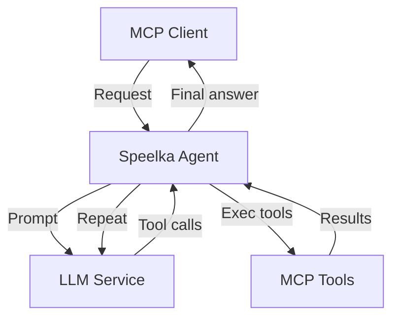
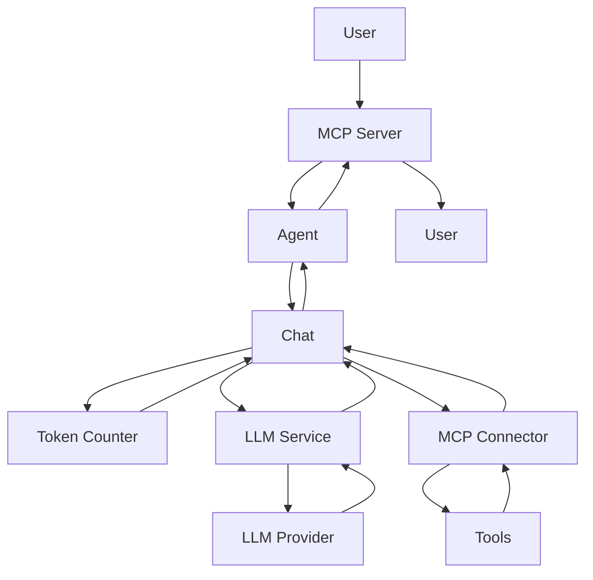
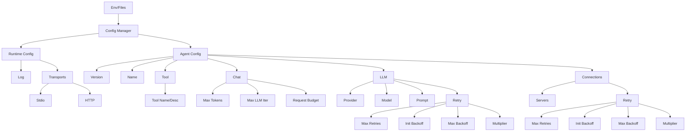

# System Architecture

## Overview
Universal LLM agent based on the Model Context Protocol (MCP). Modular, extensible, and clean architecture. All components are interface-driven, testable, and follow single-responsibility principle.

## Principles
- Single-responsibility components
- Dependency injection
- Interface-based design
- Centralized configuration
- Structured error handling
- Secure by default

## High-Level Flow

## Main Components
- **Agent** (`internal/agent`): Orchestrates LLM loop, tool execution, and chat state. Exposes a clean interface for app layer. No config/server/CLI logic.
- **App Layer** (`internal/app_*`): Application wiring, lifecycle, CLI/server entrypoints. Manages config, logger, MCP server, agent instance.
- **Config Manager**: Loads and validates config (env, YAML, JSON), provides typed access.
- **LLM Service**: Handles LLM requests, retry logic, returns structured responses.
- **MCP Server**: Exposes agent via HTTP/stdio, manages tools, processes requests.
- **MCP Connector**: Connects to external MCP servers, routes tool calls, manages timeouts.
- **Chat**: Manages history, formatting, token/cost tracking, enforces request budget.
- **Logger**: Centralized logging (logrus/MCP protocol), client notifications.

## Data Flow
1. User → MCP Server
2. Agent → Chat session
3. LLM Service (prompt + tools)
4. LLM → text/tool calls
5. MCP Connector → tool exec
6. Tool results → Chat
7. Token/cost check
8. Repeat until answer
9. Response → User

## Error Handling
- Categories: Validation, Transient, Internal, External
- Retry per error type
- Context-rich, sanitized messages
- No panics, always check nil
- Orphaned tool calls are auto-removed and logged

## Security
- API keys via env/secure storage
- Sanitized logs/errors
- HTTP transport security
- Tool access control

## Transports
- Daemon: HTTP server
- CLI: stdio (direct call mode)

## Dependencies
- `mcp-go`: MCP protocol
- `langchaingo`: LLM abstraction
- `logrus`: Logging

## Configuration
- Flexible: YAML, JSON, env
- Type-safe, validated, secure
- Load order: default → file → env

## Testing
- Unit: 75%+ coverage
- Integration: component, config, API
- E2E: agent, transport, tools, token/cost

## Diagrams
### Request Flow

### Config Structure

## Direct Call Mode
- `--call` flag: single-shot agent run, outputs structured JSON to stdout
- All errors mapped to JSON and exit codes (0: success, 1: user/config, 2: internal/tool)
- Use cases: scripting, automation, CI

## Logging
- Centralized logger (logrus/MCP)
- No log duplication
- Dynamic log level via protocol
- No secrets/PII in logs

## Configuration Overlay Testing

### Property-based overlay tests
- Используется пакет `testing/quick` для генерации случайных пар конфигураций.
- Проверяется, что overlay не затирает дефолтные значения zero-value полями, корректно мержит map, не теряет значения.
- Включены edge-cases: пустые строки, нули, nil map, частично заполненные структуры.
- Тест: `TestConfiguration_Overlay_PropertyBased` в `internal/types/configuration_test.go`.

### Golden-тесты обратной совместимости
- Для контроля совместимости сериализации структуры `types.Configuration` используется golden-файл `testdata/configuration_golden.json`.
- Тест сериализует дефолтную конфигурацию и сравнивает с эталоном.
- При изменении структуры тест сигнализирует о несовместимости.
- Тест: `TestConfiguration_Serialization_Golden` в `internal/types/configuration_test.go`.

# Архитектура логирования MCPConnector

## Логика маршрутизации логов

- После инициализации соединения с MCP-сервером (метод ConnectServer) коннектор сохраняет capabilities сервера.
- Если capabilities.Logging присутствует:
    - Для stdio-серверов: подписка на notifications/message через OnNotification, маршрутизация логов в основной логгер.
    - Для HTTP-серверов: (аналогично, через SSE, если реализовано).
- Если capabilities.Logging отсутствует:
    - Для stdio-серверов: запускается отдельная горутина, читающая stderr дочернего процесса и пробрасывающая строки в основной логгер.
    - Для HTTP fallback не реализован (невозможно получить stderr).

## Место реализации
- Вся логика выбора маршрута логирования теперь вынесена:
    - internal/mcp_connector/connection.go — логика подключения и инициализации MCP клиентов
    - internal/mcp_connector/logging.go — маршрутизация логов (MCP-логи или fallback на stderr)
- Для чтения stderr используется client.GetStderr и bufio.Scanner.
- Для подписки на MCP-логи используется OnNotification.

## Тестирование
- Покрытие тестами:
    - Проверяется сохранение capabilities после initialize.
    - Проверяется, что при наличии logging логи маршрутизируются через MCP.
    - Проверяется, что при отсутствии logging логи маршрутизируются через stderr.
- Тесты: internal/mcp_connector/mcp_connector_test.go

## Паттерны и принципы
- Применён паттерн feature toggle (capabilities как флаг).
- Используется dependency injection для логгера.
- Все изменения покрыты unit-тестами.
