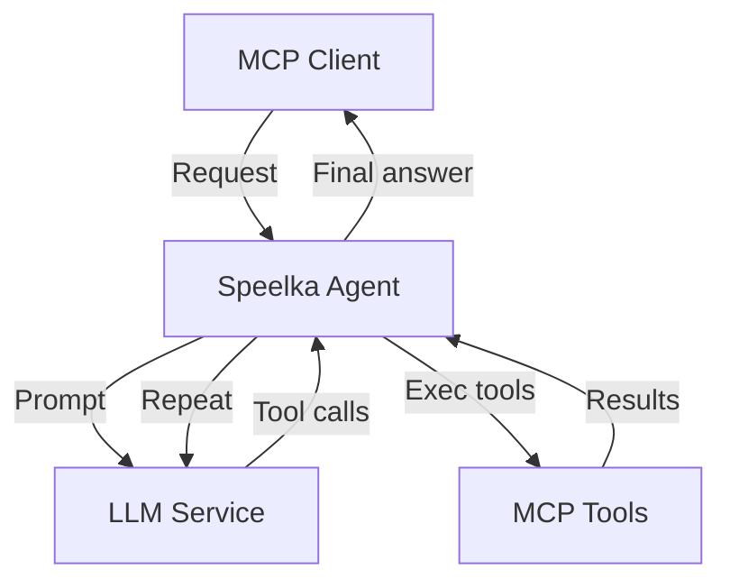
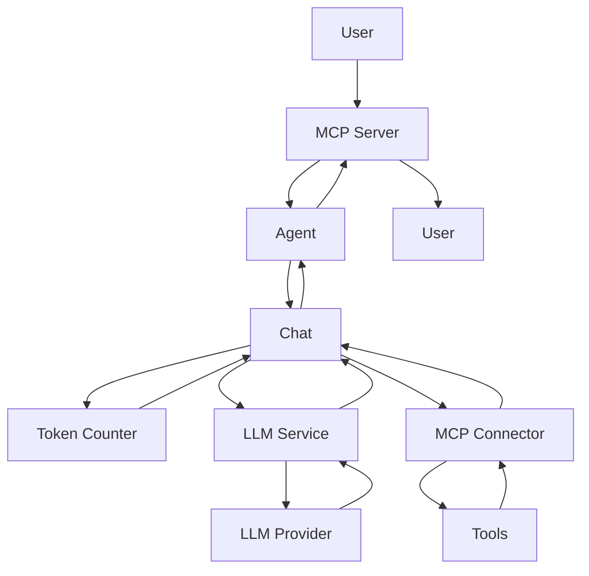
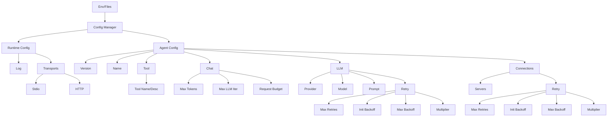

# System Architecture

## Overview
- Universal LLM agent (MCP-based)
- Modular, extensible, clean architecture

## Principles
- Single-responsibility components
- Dependency injection
- Interface-driven, testable
- Structured error handling
- Centralized config

## High-Level Flow


## Components
- **Agent (internal/agent)**: Core agent logic only. Orchestrates flow, manages state, LLM loop, tool exec, chat state (token/cost tracked via LLMResponse, fallback estimation if needed). No config loading, server, CLI, or direct call JSON types. Exposes a clean interface for use by the app layer.
- **App (internal/app)**: Application wiring, orchestration, lifecycle, CLI. Instantiates and manages the agent, provides CLI entry points. Owns config, logger, MCP server, agent instance. Includes `App` (server/daemon mode) and `DirectApp` (CLI direct-call mode, independent from `App`). Shared stateless utilities for config loading, agent instantiation, etc.
- **Config Manager**: Loads/validates config (env, YAML, JSON), provides typed access, matches `types.Configuration` structure
- **LLM Service**: Handles LLM requests, retry logic, returns `LLMResponse` (text, tool calls, token/cost)
- **MCP Server**: Exposes agent (HTTP, stdio), manages tools, processes requests
- **MCP Connector**: Connects to external MCP servers, routes tool calls, manages connections
- **Chat**: Manages history, formatting, token/cost, context, all state in `chatInfo` struct, immutable config, enforces `request_budget` (limits total cost per request). **TotalTokens** and **TotalCost** are cumulative (monotonically increasing) and never decrease. Chat history is not compacted or compressed.
  - **Tool call/result contract:** Every tool_call (function/tool request) must be followed by a tool result (response) before the next LLM request. If a tool_call is found without a result (orphaned), it is now automatically removed from the message stack and a warning is logged.
- **Logger**: Wraps logrus, MCP protocol logging, client notifications

## Data Flow
1. User → MCP Server
2. Agent → Chat session
3. LLM Service (prompt + tools)
4. LLM → text/tool calls
5. MCP Connector → tool exec
6. Tool results → Chat
7. Token check
8. Repeat until answer
9. Response → User

## Error Handling
- Categories: Validation, Transient, Internal, External
- Retry: Per error type
- Context-rich, sanitized messages
- Graceful degradation
- Principles: Always check nil, safe assertions, descriptive errors, no panics
- **Orphaned tool_call auto-cleanup:** The system detects and removes orphaned tool calls (calls without results) from the message stack before sending to the LLM, logging a warning. This prevents protocol errors and ensures robust operation even if an error or interruption occurs after a tool call is issued.

## Security
- API keys: env/secure storage
- Sanitized logs/errors
- HTTP transport security
- Tool access control

## Multi-Transport
- Daemon: HTTP server (via `internal/app.App`)
- CLI: stdio (via `internal/app.DirectApp`)

## Dependencies
- `mcp-go`: MCP impl
- `langchaingo`: LLM client
- `logrus`: Logging

## Config System
- Flexible: YAML, JSON, env
- Type-safe, validated, defaults
- Secure: API keys via env
- Only `Apply` parses log level/output
- Load order: default → file → env

## Testing
- Unit: 75%+ coverage, mocks
- Config: defaults, overrides, validation, transport
- Integration: component, config, API
- E2E: agent, transport, tools, token/cost/approximation

## Diagrams
### Request Flow


### Config Structure


## Direct Call Mode (CLI)
- **Flag:** `--call` (string, user query)
- **Behavior:** Runs agent in single-shot mode, bypassing MCP server. Outputs a structured JSON result to stdout. Uses `internal/app.DirectApp` (independent from `App`, wires up agent and dependencies for direct call mode).
- **Output Structure:**
  ```json
  {
    "success": true/false,
    "result": { "answer": "..." },
    "meta": { "tokens": ..., "cost": ..., "duration_ms": ... },
    "error": { "type": "...", "message": "..." }
  }
  ```
- **Error Handling:** All errors are mapped to JSON output and exit codes:
  - `0`: success
  - `1`: user/config error
  - `2`: internal/agent/LLM/tool error
- **Implementation:** Uses `DirectApp` (thin wrapper), reuses all config/env/agent logic.
- **Use Cases:** Scripting, automation, debugging, CI integration.
