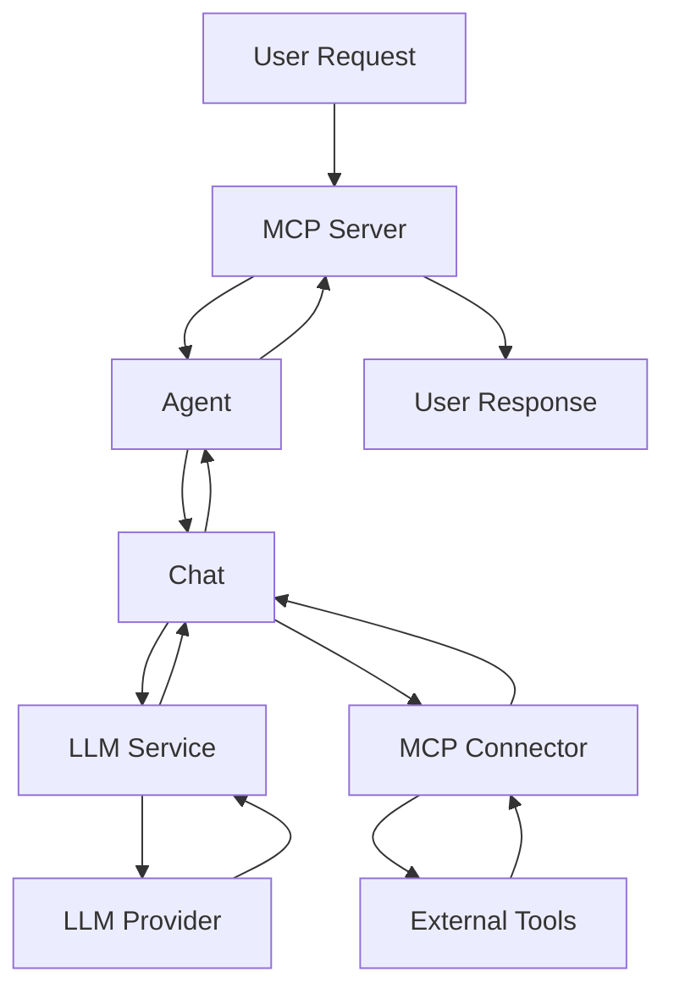
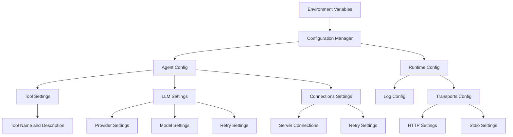
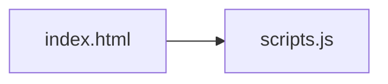
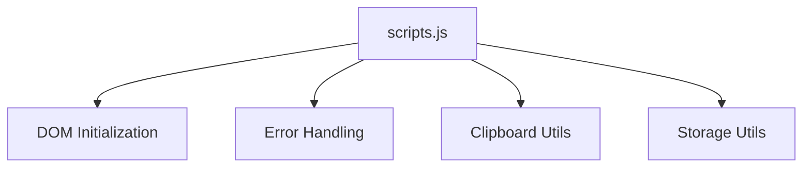

# Speelka Agent Architecture

## Overview
Speelka Agent = Universal LLM agent using Model Context Protocol (MCP). Modular, extensible system with clean architecture.

## Key Advantages
1. **Client-Side Context Optimization**: ↓ context size = ↓ token usage, ↓ costs
2. **LLM Flexibility**: Different LLMs between client/agent = optimized performance/cost
3. **Precise Agent Definition**: Detailed behavior via prompt engineering
4. **Centralized Tool Management**: Single control point for all tools
5. **Integration Options**: MCP stdio, MCP HTTP*, Simple HTTP API* (*planned)
6. **Reliability**: Built-in retry mechanisms for transient failures
7. **Extensibility**: System extensions without client-side changes

## Core Design Principles
1. **Separation of Concerns**: Single responsibility per component
2. **Dependency Injection**: Dependencies via constructors
3. **Interface-Based Design**: Components implement interfaces for testability
4. **Error Handling Strategy**: Structured, categorized error handling
5. **Configuration Management**: Centralized config with component-specific subsets

## Key Components

### Agent
- Central orchestrator coordinating all components
- Manages conversation flow: user ↔ LLM ↔ tools
- Processes user requests via MCP server
- Controls LLM interaction loop
- Delegates tool execution to MCP connector
- Maintains conversation state via Chat component

### Configuration Manager
- Centralized config access point
- Loads config from env vars/files
- Provides typed access to config subsets
- Implements `ConfigurationManagerSpec` interface

### LLM Service
- Handles LLM provider communication
- Supports multiple providers (OpenAI, Anthropic)
- Formats/sends requests to LLMs
- Processes responses, extracts tool calls
- Implements retry logic for transient errors

### MCP Server
- Exposes agent functionality to clients
- Supports HTTP and stdio protocols
- Registers/manages available tools
- Processes incoming requests
- Returns responses to clients

### MCP Connector
- Connects to external MCP servers for tool execution
- Manages connections to multiple MCP servers
- Discovers available tools from connected servers
- Routes tool calls to appropriate servers
- Returns tool execution results

### Chat
- Manages conversation history/formatting
- Maintains message history: user ↔ assistant ↔ tools
- Formats prompts with templates
- Provides conversation context for LLM requests
- Tracks tool calls and results

## Data Flow
1. User request → MCP Server
2. Agent processes request, initializes Chat session
3. LLM Service called with formatted prompt + available tools
4. LLM responds with text and/or tool calls
5. For each tool call, MCP Connector executes tool on appropriate server
6. Tool results added to Chat history
7. Process repeats until LLM issues "answer" command
8. Final response returned to user via MCP Server

## Error Handling
- **Categories**: Validation, Transient, Internal, External
- **Retry**: Appropriate mechanisms per error type
- **Context-rich messages**: Minimal sensitive information

### Handling Nil Interface Values
1. **Always Check for Nil**: Before type assertions on interface{} values
   ```go
   argValue, exists := someMap[key]
   if !exists || argValue == nil {
       // Handle nil case
   }
   ```

2. **Safe Type Assertions**: Use two-return form
   ```go
   strValue, ok := argValue.(string)
   if !ok {
       // Handle type assertion failure
   }
   ```

3. **Descriptive Error Messages**: Include expected vs actual type
4. **Return Graceful Errors**: Clear errors vs panics

## Configuration
- Env vars for different aspects:
  - Agent info (name, version)
  - Tool settings (name, description, arguments)
  - LLM service settings (provider, model, API key)
  - MCP connector config
  - Transport settings (HTTP, stdio)
  - Logging config

Example:
```bash
# Agent settings
export AGENT_NAME="speelka-agent"
export AGENT_VERSION="1.0.0"

# Tool settings
export TOOL_NAME="process"
export TOOL_DESCRIPTION="Process tool for handling user queries with LLM"

# LLM settings
export LLM_PROVIDER="openai"
export LLM_MODEL="gpt-4o"

# MCP servers
export MCPS_0_ID="time"
export MCPS_0_COMMAND="docker"
export MCPS_0_ARGS="run -i --rm mcp/time"
```

## External Dependencies
- `mcp-go`: Go implementation of Model Context Protocol
- `langchaingo`: Go client for LLM interaction
- `logrus`: Structured logging
- Standard Go libraries

## Security Considerations
- API keys from env vars/secure storage
- Sensitive info sanitized in errors/logs
- Transport security options for HTTP

## Multi-Transport Support
- **Daemon mode**: HTTP server for multi-client support
- **CLI mode**: Stdin/stdout for command-line usage





## Website Component Structure

### JavaScript Organization
- **scripts.js**: General utilities and common website functionality
  - Error handling
  - Clipboard operations
  - Form validation
  - Storage management
  - DOM manipulation
  - General page initialization

This modular approach improves maintainability by separating concerns and allowing for easier updates to specific parts of the codebase.



## Site Directory Architecture

The `site` directory contains the landing page for Speelka Agent, using a modern HTML/CSS/JavaScript stack.

### Component Structure

```
site/
├── index.html        # Main HTML file with the landing page
├── js/               # JavaScript modules
│   ├── scripts.js    # Core utilities and application initialization
├── css/              # Stylesheet files
│   └── styles.css    # Main CSS file with responsive design
├── img/              # Image assets and icons
├── sitemap.xml       # Site map for search engines
└── robots.txt        # Robots instructions for search engines
```

### Module Dependencies

The JavaScript files are designed with the following dependency structure:



### JavaScript Module Responsibilities

1. **scripts.js**:
   - Core utility modules (ErrorHandler, ClipboardUtils, StorageUtils, DOMUtils)
   - Application initialization and DOM setup
   - Navigation and UI behavior
   - Event handling for common elements

### Known Technical Debt

1. **External Library Dependencies**:
   - Dependencies are loaded using unpinned versions (latest tag), which could cause unexpected breaking changes
