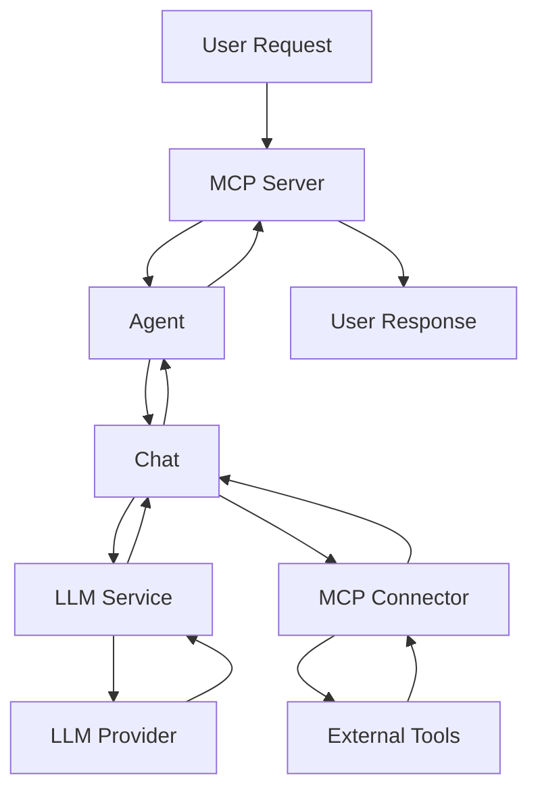
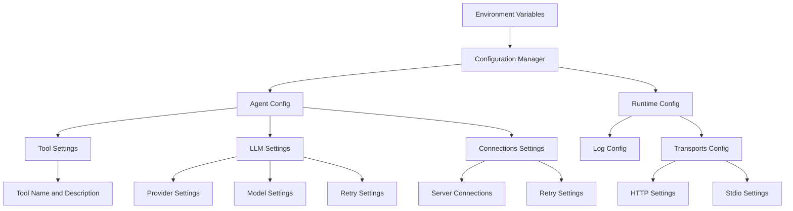

# Speelka Agent Architecture

## Overview

Speelka Agent is a Go-based implementation of an agent system that integrates with Large Language Models (LLMs) and provides tool execution capabilities through the Model Context Protocol (MCP). The system is designed to be modular, extensible, and follows clean architectural patterns.

## Key Advantages

Speelka Agent offers significant benefits for LLM system integrations:

1. **Client-Side Context Optimization**: Reduces context size requirements on the client side, resulting in more efficient token usage and cost savings
2. **LLM Flexibility**: Allows different LLM providers and configurations between client and agent sides, optimizing for performance and cost
3. **Precise Agent Definition**: Enables detailed agent behavior definition through prompt engineering
4. **Centralized Tool Management**: Provides a single point of control for all available tools
5. **Integration Options**: Supports multiple integration methods including MCP stdio, MCP HTTP* and Simple HTTP API* (*planned)
6. **Reliability**: Includes built-in retry mechanisms for handling transient failures
7. **Extensibility**: Supports system behavior extensions without requiring client-side changes

## Core Design Principles

1. **Separation of Concerns**: Each component has a single responsibility
2. **Dependency Injection**: Components receive their dependencies through constructors
3. **Interface-Based Design**: Key components implement interfaces for testability
4. **Error Handling Strategy**: Structured error handling with appropriate categorization
5. **Configuration Management**: Centralized configuration with specific subsets for components

## Key Components

### Agent

The central orchestrator that coordinates all other components:

- Manages the conversation flow between user, LLM, and tools
- Processes user requests coming through the MCP server
- Controls the LLM interaction loop
- Delegates tool execution to the MCP connector
- Maintains conversation state through the Chat component

### Configuration Manager

Provides centralized access to all configuration settings:

- Loads configuration from environment variables or config files
- Provides typed access to configuration subsets for different components
- Implements the `ConfigurationManagerSpec` interface

### LLM Service

Handles communication with Language Model providers:

- Supports multiple LLM providers (OpenAI, Anthropic)
- Formats and sends requests to LLMs
- Processes responses and extracts tool calls
- Implements retry logic for transient errors

### MCP Server

Exposes the agent functionality to clients:

- Supports HTTP and stdio transport protocols
- Registers and manages available tools
- Processes incoming requests
- Returns responses to clients

### MCP Connector

Connects to external MCP servers to execute tools:

- Manages connections to multiple MCP servers
- Discovers available tools from connected servers
- Routes tool calls to appropriate servers
- Returns tool execution results

### Chat

Manages the conversation history and formatting:

- Maintains a history of messages between user, assistant, and tools
- Formats prompts with appropriate templates
- Provides the conversation context for LLM requests
- Tracks tool calls and their results

## Data Flow

1. User request comes through the MCP Server
2. Agent processes the request and initializes a Chat session
3. LLM Service is called with the formatted prompt and available tools
4. LLM responds with text and/or tool calls
5. For each tool call, MCP Connector executes the tool on an appropriate server
6. Tool results are added to the Chat history
7. The process repeats until LLM issues an "answer" command
8. Final response is returned to the user through MCP Server

## Error Handling

The system uses a structured error handling approach:

- Errors are categorized (Validation, Transient, Internal, External)
- Appropriate retry mechanisms for different error types
- Context-rich error messages with minimal sensitive information

### Handling Nil Interface Values

When working with interface{} values from dynamic sources (such as JSON-decoded data or external APIs), the following practices should be observed:

1. **Always Check for Nil**: Before performing type assertions on interface{} values, check if the value is nil:
   ```go
   argValue, exists := someMap[key]
   if !exists || argValue == nil {
       // Handle the case where the value doesn't exist or is nil
   }
   ```

2. **Use Safe Type Assertions**: When converting interface{} to concrete types, use the two-return form of type assertion:
   ```go
   strValue, ok := argValue.(string)
   if !ok {
       // Handle type assertion failure
   }
   ```

3. **Provide Descriptive Error Messages**: Include the expected type and actual type in error messages:
   ```go
   if !ok {
       logger.Errorf("invalid type: expected string, got %T", argValue)
   }
   ```

4. **Return Graceful Errors**: When a type assertion fails, return a clear error to the caller rather than allowing a panic to occur.

This approach was implemented to fix a critical issue in the Agent's HandleRequest method, where a nil interface{} value was causing a panic when attempting a direct type assertion without proper checking.

## Configuration Structure

The configuration is provided through a single `CONFIG_JSON` environment variable containing a complete JSON structure.

### Environment Variables

The system also supports direct configuration through specific environment variables that override values in the JSON configuration:

- `LLM_API_KEY`: Overrides the API key for the LLM provider specified in the JSON configuration.

### JSON Configuration Structure

The JSON configuration structure is hierarchically organized:

```json
{
  "agent": {
    "name": "speelka-agent",
    "version": "1.0.0",
    "tool": {
      "name": "process",
      "description": "Process tool for handling user queries with LLM",
      "argument_name": "input",
      "argument_description": "User query to process"
    },
    "llm": {
      "provider": "openai",
      "api_key": "your_api_key_here",
      "model": "gpt-4o",
      "max_tokens": 0,
      "temperature": 0.7,
      "prompt_template": "You are a helpful AI assistant...",
      "retry": {
        "max_retries": 3,
        "initial_backoff": 1.0,
        "max_backoff": 30.0,
        "backoff_multiplier": 2.0
      }
    },
    "connections": {
      "servers": [
        {
          "id": "server-id-1",
          "transport": "stdio",
          "command": "docker",
          "arguments": ["run", "-i", "--rm", "mcp/time"],
          "environment": {
            "NODE_ENV": "production"
          }
        }
      ],
      "retry": {
        "max_retries": 3,
        "initial_backoff": 1.0,
        "max_backoff": 30.0,
        "backoff_multiplier": 2.0
      }
    }
  },
  "runtime": {
    "log": {
      "level": "info",
      "output": "stdout"
    },
    "transports": {
      "stdio": {
        "enabled": true,
        "buffer_size": 8192,
        "auto_detect": false
      },
      "http": {
        "enabled": true,
        "host": "localhost",
        "port": 3000
      }
    }
  }
}
```

## External Dependencies

- `mcp-go`: Go implementation of the Model Context Protocol
- `langchaingo`: Go client for interacting with Language Models
- `logrus`: Structured logging library
- Standard Go libraries

## Security Considerations

- API keys are loaded from environment variables or secure storage
- Sensitive information is sanitized in error messages and logs
- Transport security options for HTTP connections

## Multi-Transport Support

The system can operate in different modes:

- Daemon mode: HTTP server for multi-client support
- CLI mode: Standard input/output for command-line usage




