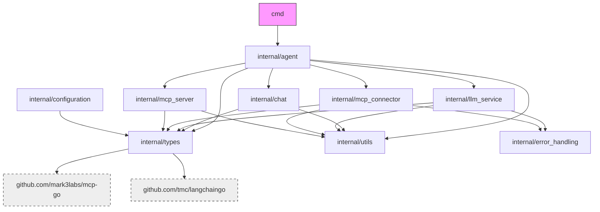

# Project File Structure

## Root Directory
- `/cmd`: CLI app entry points
- `/internal`: Core app code (not for external import)
- `/vendor`: Vendored deps
- `/bin`: Compiled binaries/scripts
- `/context`: Project context docs
- `/docs`: Project docs
- `run`: Shell script for common commands
- `go.mod`/`go.sum`: Go module def & deps
- `.env`/`.env.example`: Env vars (real & example)
- `README.md`: Project overview
- `Dockerfile`: Multi-stage Docker build config
- `.github/workflows`: CI/CD configs

## Internal Package Structure

### `/internal/agent`
- `agent.go`: Agent implementation (orchestrates all components)

### `/internal/chat`
- `chat.go`: Chat history mgmt & formatting
- `chat_test.go`: Chat package tests

### `/internal/configuration`
- `manager.go`: Config manager impl

### `/internal/error_handling`
- Error handling utils & strategies

### `/internal/llm_service`
- `llm_service.go`: LLM provider comm service

### `/internal/mcp_connector`
- `mcp_connector.go`: External MCP server client

### `/internal/mcp_server`
- `mcp_server.go`: MCP protocol server impl

### `/internal/types`
- `call_tool_request.go`: Tool call request defs
- `configuration_spec.go`: Config interface & types
- `convert_tool_to_llm.go`: MCP/LLM tool conversion utils
- `convert_tool_to_llm_test.go`: Conversion util tests
- `llm_service_spec.go`: LLM service interface & types
- `mcp_server_spec.go`: MCP server interface & types
- `metrics_spec.go`: Metrics collection interfaces & types

### `/internal/utils`
- Shared utility functions

## Key External Dependencies

| Package | Description | Usage |
|---------|-------------|-------|
| `github.com/mark3labs/mcp-go` | MCP Go impl | MCP server/client |
| `github.com/tmc/langchaingo` | LLM Go client | LLM integration |
| `github.com/sirupsen/logrus` | Structured logging | App logging |

## Package Dependencies



## Architecture Patterns

### Dependency Direction
Clean architecture with inward dependencies:
1. Command (`/cmd`) → agent
2. Agent orchestrates all components
3. Components → types & utils
4. No circular dependencies

### Interface Definitions
Interfaces in `types` package, implemented elsewhere:
- `ConfigurationManagerSpec` → `configuration.Manager`
- `MCPServerSpec` → `mcp_server.MCPServer`
- `MetricsCollectorSpec` → metrics collectors (future)

### Testing Strategy
- Test files co-located with implementation (`_test.go` suffix)
- Focus on unit tests for core functionality

### Error Handling
Categorized errors via `error_handling` package:
- Validation errors (config, input)
- Transient errors (network, rate limits)
- Internal errors (component failures)
- External errors (tool execution failures)

## CI/CD Workflows

### `.github/workflows/docker-build.yml`
- Builds & pushes multi-arch Docker images
- Archs: linux/amd64, linux/arm64, linux/arm/v7
- Uses Docker Buildx & QEMU for cross-platform
- Pushes to GitHub Container Registry with tags

## File Structure

```
speelka-agent/
├── README.md
├── documents/
│   ├── architecture.md
│   ├── file_structure.md
│   ├── implementation.md
│   └── knowledge.md
├── examples/
│   └── simple.env
└── site/
    ├── index.html
    ├── css/
    │   ├── styles.css
    │   └── normalize.css
    ├── js/
    │   └── scripts.js
    └── img/
        ├── logo.svg
        ├── flow-diagram.svg
        └── speelka-icon.png
```

### Main Directories

- **documents/**: Technical documentation about the project
- **examples/**: Example configuration files for Speelka Agent
- **site/**: Project website with simplified documentation

### Key Files

#### Site

- **index.html**: Main landing page with usage examples and basic documentation
- **css/styles.css**: Main stylesheet for the website
- **js/scripts.js**: Core JavaScript functionality for the website
- **img/**: Directory containing images and icons

#### Documents

- **architecture.md**: System architecture and design patterns
- **file_structure.md**: This file, describing the project structure
- **implementation.md**: Implementation details and testing strategies
- **knowledge.md**: Resources, links, and code snippets

#### Examples

- **simple.env**: Example environment configuration file for Speelka Agent
