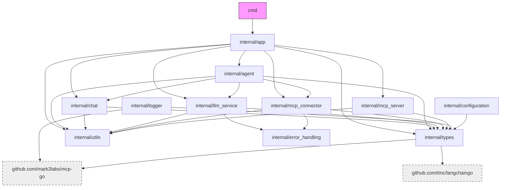

# File Structure

## Root
- `README.md`: Project overview
- `go.mod`, `go.sum`: Go modules
- `Makefile`, `Dockerfile`, `run`: Build, run, CI
- `LICENSE`: MIT
- `.github/`: CI/CD workflows
- `cmd/server/`: Main entry
- `internal/`: Core logic
- `site/`: Web UI, config examples
- `vendor/`: Vendored deps
- `documents/`: Docs

## Key Directories
- `cmd/server/`: Entrypoint (`main.go`)
- `configs/`: Templates
- `documents/`: Docs (see below)
- `internal/`: All core packages
- `site/`: Web, config examples, assets
- `vendor/`: Vendored Go deps

## Internal Structure

### Key Packages
- `internal/agent`: Core agent logic (LLM, tool orchestration, session management). No config loading, server, CLI, or direct call JSON types.
- `internal/app`: Application wiring, orchestration, lifecycle, CLI. Instantiates and manages the agent, provides CLI entry points. Includes `App` (server/daemon mode) and `DirectApp` (CLI direct-call mode, independent from `App`). Shared stateless utilities for config loading, agent instantiation, etc.

## Examples (site/examples/)
- `minimal.yaml`, `ai-news.yaml`, `architect.yaml`: Agent configs (YAML, preferred), include `agent.chat.request_budget` (limit on total cost per request)

## Dependencies
| Package | Use |
|---------|-----|
| github.com/mark3labs/mcp-go | MCP impl |
| github.com/tmc/langchaingo | LLM client |
| github.com/sirupsen/logrus | Logging |
| github.com/pkoukk/tiktoken-go | Token count |

## Documents
- `architecture.md`: System design
- `file_structure.md`: This file
- `implementation.md`: Implementation
- `knowledge.md`: Code/protocol refs
- `remote_resources.md`: External links
- `whiteboard.md`: Temp planning (ephemeral)
