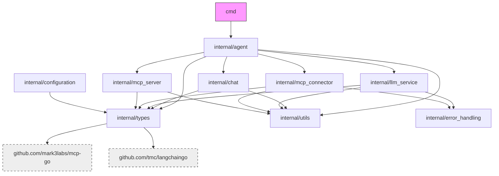

# Project File Structure

## Root Directory

- `/cmd`: Command-line application entry points
- `/internal`: Core application code (not meant for external import)
- `/vendor`: Vendored dependencies
- `/bin`: Compiled binaries and helper scripts
- `/context`: Project context documentation
- `/docs`: Project documentation
- `run`: Shell script for running common commands
- `go.mod`: Go module definition
- `go.sum`: Go module dependency checksums
- `.env`: Environment variables (gitignored)
- `.env.example`: Example environment variables
- `README.md`: Project overview and usage instructions

## Internal Package Structure

### `/internal/agent`

- `agent.go`: Agent implementation that orchestrates all components

### `/internal/chat`

- `chat.go`: Chat history management and formatting
- `chat_test.go`: Tests for the chat package

### `/internal/configuration`

- `manager.go`: Configuration manager implementation

### `/internal/error_handling`

- Error handling utilities and strategies

### `/internal/llm_service`

- `llm_service.go`: Service for communicating with LLM providers

### `/internal/mcp_connector`

- `mcp_connector.go`: Client for connecting to external MCP servers

### `/internal/mcp_server`

- `mcp_server.go`: Server implementation of the MCP protocol

### `/internal/types`

- `call_tool_request.go`: Tool call request definitions
- `configuration_spec.go`: Configuration interface and types
- `convert_tool_to_llm.go`: Conversion utilities between MCP and LLM tools
- `convert_tool_to_llm_test.go`: Tests for the conversion utilities
- `llm_service_spec.go`: LLM service interface and types
- `mcp_server_spec.go`: MCP server interface and types
- `metrics_spec.go`: Metrics collection interfaces and types

### `/internal/utils`

- Utility functions shared across packages

## Key External Dependencies

| Package | Description | Usage |
|---------|-------------|-------|
| `github.com/mark3labs/mcp-go` | Model Context Protocol Go implementation | MCP server and client |
| `github.com/tmc/langchaingo` | Go client for language models | LLM integration |
| `github.com/sirupsen/logrus` | Structured logging | Application logging |

## Package Dependencies

## File Organization Patterns

### Dependency Direction

The project follows a clean architecture pattern with dependencies pointing inward:

1. Command (`/cmd`) depends on agent
2. Agent orchestrates all components
3. Components depend on types and utilities
4. No circular dependencies between components

### Interface Definitions

Interfaces are defined in the `types` package and implemented by other packages:

- `ConfigurationManagerSpec` → implemented by `configuration.Manager`
- `MCPServerSpec` → implemented by `mcp_server.MCPServer`
- `MetricsCollectorSpec` → implemented by metrics collectors (when added)

### Testing Strategy

- Test files are co-located with implementation files
- `_test.go` suffix for test files
- Focus on unit tests for core functionality

### Error Handling

Errors are categorized and wrapped using the `error_handling` package:
- Validation errors (configuration, input)
- Transient errors (network issues, rate limits)
- Internal errors (component failures)
- External errors (tool execution failures)
