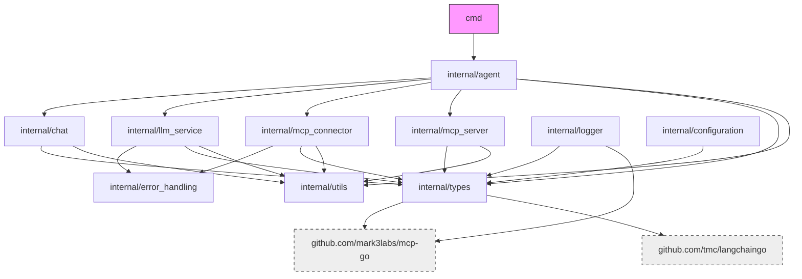

# File Structure

## Project Structure

```
speelka-agent/
├── .github/                 # GitHub workflows and configuration
├── cmd/
│   └── server/              # Entry point for the application
├── configs/                 # Configuration templates
├── documents/               # Project documentation
│   ├── architecture.md      # System architecture details
│   ├── implementation.md    # Implementation details
│   ├── file_structure.md    # This file
│   ├── remote_resources.md  # Links to external resources
│   └── whiteboard.md        # Temporary workspace for planning (deleted upon completion)
├── internal/                # Internal packages
│   ├── agent/               # Agent implementation
│   ├── chat/                # Chat session management
│   │   ├── chat.go               # Chat history management (stores LLMResponse objects for assistant messages, unified chatInfo struct for all state)
│   │   └── compaction.go         # Token management strategies, uses centralized fallback estimation utility
│   ├── config/              # Configuration loading and parsing
│   ├── connector/           # MCP connector for tool execution
│   ├── log/                 # Logging utilities
│   ├── prompt/              # Prompt templates and management
│   ├── tools/               # Tool definitions and implementations
│   └── transports/          # Transport layers (stdio, HTTP)
├── site/                    # Website files
│   ├── css/                 # CSS styles
│   ├── examples/            # Example configuration files (used for website)
│   ├── img/                 # Images
│   ├── js/                  # JavaScript files
│   └── index.html           # Main website page
├── vendor/                  # Vendored dependencies
├── .gitignore               # Git ignore file
├── go.mod                   # Go module file
├── go.sum                   # Go dependencies checksum
├── LICENSE                  # License file
├── Makefile                 # Build and development tasks
└── README.md                # Project overview
```

## Key Directories

### `cmd/server/`
Contains the main entry point for the application.

### `configs/`
Contains configuration templates and examples.

### `documents/`
Contains project documentation, including architecture, implementation details, and this file structure document.

### `internal/`
Contains all internal packages used by the application.

### `site/examples/`
Contains example configuration files in YAML, JSON, and environment variable format:
- `simple.yaml` - Basic example in YAML format
- `simple.json` - Basic example in JSON format
- `simple.env` - Basic example using environment variables
- `ai-news.yaml` - AI news agent example in YAML format
- `ai-news.json` - AI news agent example in JSON format
- `ai-news.env` - AI news agent example using environment variables
- `architect.yaml` - Architecture consultant agent in YAML format
- `architect.json` - Architecture consultant agent in JSON format
- `architect.env` - Architecture consultant agent using environment variables

### `vendor/`
Contains vendored dependencies.

## Root Directory

```
speelka-agent/
├── README.md                 # Project overview
├── go.mod, go.sum            # Go module and dependencies
├── run                       # Shell script for common commands
├── Dockerfile                # Multi-stage Docker build config
├── LICENSE                   # MIT License
├── cmd/                      # Command-line entry points
├── internal/                 # Core application code
├── vendor/                   # Vendored dependencies
├── bin/                      # Compiled binaries/scripts
├── documents/                # Project documentation
├── site/                     # Project website
└── .github/workflows/        # CI/CD configurations
```

## Command Line Entry Points

```
cmd/
└── server/
    └── main.go               # Main application entry point
```

## Internal Package Structure

```
internal/
├── agent/
│   └── agent.go              # Agent implementation
├── chat/
│   ├── chat.go               # Chat history management
│   └── compaction.go         # Token management strategies
├── configuration/
│   ├── manager.go            # Configuration manager
│   ├── default_loader.go     # Default configuration values
│   ├── env_loader.go         # Environment variable loader
│   ├── json_loader.go        # JSON configuration loader
│   ├── yaml_loader.go        # YAML configuration loader
│   └── loader_spec.go        # Common interface for configuration loaders
├── error_handling/
│   └── *.go                  # Error handling utilities
├── llm_service/
│   └── llm_service.go        # LLM provider communication
├── logger/
│   └── logger.go             # MCP-compatible logger (replaces mcplogger)
├── mcp_connector/
│   └── mcp_connector.go      # External MCP server client
├── mcp_server/
│   └── mcp_server.go         # MCP protocol server
├── types/
│   ├── call_tool_request.go  # Tool call request definitions
│   ├── configuration.go      # Configuration structure
│   ├── agent_spec.go         # Agent interfaces
│   ├── logger_spec.go        # Logger interfaces
│   ├── mcp_server_spec.go    # MCP server interfaces and types
│   ├── convert_tool_to_llm.go # MCP/LLM tool conversion
│   ├── llm_service_spec.go   # LLM service interfaces (LLMResponse includes LLMResponses field)
│   └── metrics_spec.go       # Metrics collection interfaces
└── utils/
    └── tokenization.go       # Token counting utilities
```

## Site Directory

```
site/
├── index.html                # Main landing page
├── css/
│   └── styles.css            # Main stylesheet
├── js/
│   └── scripts.js            # Core JavaScript functionality
├── examples/                 # Configuration examples
│   ├── simple.yaml           # Basic agent configuration in YAML format (preferred)
│   ├── ai-news.yaml          # AI news agent example in YAML format
│   └── architect.yaml        # Architecture consultant agent in YAML format
└── img/                      # Images and icons
    ├── logo.svg
    ├── flow-diagram.svg
    └── speelka-icon.png
```

## Examples Directory

> **Note:** The `./examples` directory has been deprecated and removed. Please use the examples in the `./site/examples` directory instead.

The example configurations have been moved to the `site/examples` directory as part of the website resources:

```
site/examples/
├── simple.yaml               # Basic agent configuration in YAML format (preferred)
├── ai-news.yaml              # AI news agent configuration in YAML format (preferred)
└── architect.yaml            # Architecture analysis agent config
```

These examples demonstrate different agent configurations and can be used as templates for creating custom agents. The website now loads these examples directly from the filesystem to ensure consistency between documentation and actual implementation.

## Key External Dependencies

| Package | Description | Usage |
|---------|-------------|-------|
| `github.com/mark3labs/mcp-go` | MCP Go implementation | MCP server/client |
| `github.com/tmc/langchaingo` | LLM Go client | LLM integration |
| `github.com/sirupsen/logrus` | Structured logging | Application logging |
| `github.com/pkoukk/tiktoken-go` | Token counting | Token estimation |

## Package Dependency Graph



## CI/CD Workflows

### Docker Build Workflow

`docker-build.yml`:
- Builds and pushes multi-architecture Docker images
- Architectures: linux/amd64, linux/arm64
- Uses Docker Buildx and QEMU for cross-platform builds
- Pushes to GitHub Container Registry with appropriate tags

## Documents Directory

```
documents/
├── architecture.md           # System architecture and design
├── file_structure.md         # Project structure (this file)
├── implementation.md         # Implementation details
├── knowledge.md              # References and code examples
└── remote_resources.md       # Links to external resources
```

## Configuration Files

- `config.yaml` - Main configuration file template
- `examples/` - Directory containing example configurations
  - `basic.yaml` - Basic agent configuration with dummy API key for testing
  - `anthropic_agent.yaml` - Example configuration for Anthropic backend with dummy API key
  - `local_agent.yaml` - Example configuration for local LLM backend with dummy API key
  - `openai_agent.yaml` - Example configuration for OpenAI backend with dummy API key

## Core Files

```
internal/
├── agent/
│   └── agent.go              # Agent implementation
├── chat/
│   ├── chat.go               # Chat history management
│   └── compaction.go         # Token management strategies
├── configuration/
│   ├── manager.go            # Configuration manager
│   ├── default_loader.go     # Default configuration values
│   ├── env_loader.go         # Environment variable loader
│   ├── json_loader.go        # JSON configuration loader
│   ├── yaml_loader.go        # YAML configuration loader
│   └── loader_spec.go        # Common interface for configuration loaders
├── error_handling/
│   └── *.go                  # Error handling utilities
├── llm_service/
│   └── llm_service.go        # LLM provider communication
├── logger/
│   └── logger.go             # MCP-compatible logger (replaces mcplogger)
├── mcp_connector/
│   └── mcp_connector.go      # External MCP server client
├── mcp_server/
│   └── mcp_server.go         # MCP protocol server
├── types/
│   ├── call_tool_request.go  # Tool call request definitions
│   ├── configuration.go      # Configuration structure
│   ├── agent_spec.go         # Agent interfaces
│   ├── logger_spec.go        # Logger interfaces
│   ├── mcp_server_spec.go    # MCP server interfaces and types
│   ├── convert_tool_to_llm.go # MCP/LLM tool conversion
│   ├── llm_service_spec.go   # LLM service interfaces (LLMResponse includes LLMResponses field)
│   └── metrics_spec.go       # Metrics collection interfaces
└── utils/
    └── tokenization.go       # Token counting utilities
```

## Internal Components

- `internal/`
  - `types/` - Core types and interfaces
    - `configuration.go` - Configuration structure definitions
    - `configuration_test.go` - Tests for configuration handling and validation
    - `agent.go` - Agent interface definition
    - `response.go` - Response structure definitions
    - `request.go` - Request structure definitions

- Chat configuration (maxTokens, compactionStrategy) is now immutable and set via the constructor. No setters are available.
