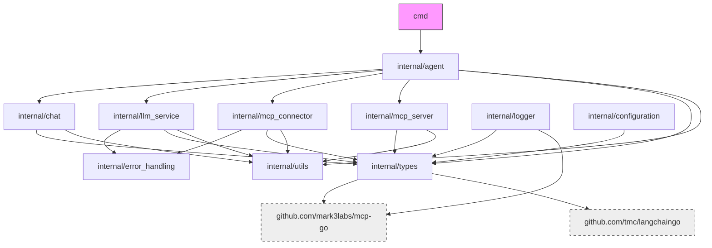

# Project File Structure

## Root Directory

```
speelka-agent/
├── README.md                 # Project overview
├── go.mod, go.sum            # Go module and dependencies
├── run                       # Shell script for common commands
├── Dockerfile                # Multi-stage Docker build config
├── LICENSE                   # MIT License
├── cmd/                      # Command-line entry points
├── internal/                 # Core application code
├── vendor/                   # Vendored dependencies
├── bin/                      # Compiled binaries/scripts
├── documents/                # Project documentation
├── examples/                 # Example configuration files
├── site/                     # Project website
└── .github/workflows/        # CI/CD configurations
```

## Command Line Entry Points

```
cmd/
└── server/
    └── main.go               # Main application entry point
```

## Internal Package Structure

```
internal/
├── agent/
│   └── agent.go              # Agent implementation
├── chat/
│   ├── chat.go               # Chat history management
│   └── compaction.go         # Token management strategies
├── configuration/
│   └── manager.go            # Configuration manager
├── error_handling/
│   └── *.go                  # Error handling utilities
├── llm_service/
│   └── llm_service.go        # LLM provider communication
├── logger/
│   └── logger.go             # MCP-compatible logger (replaces mcplogger)
├── mcp_connector/
│   └── mcp_connector.go      # External MCP server client
├── mcp_server/
│   └── mcp_server.go         # MCP protocol server
├── acceptance_test/
│   └── *.go                  # Acceptance tests
├── types/
│   ├── call_tool_request.go  # Tool call request definitions
│   ├── configuration_spec.go # Configuration interfaces
│   ├── convert_tool_to_llm.go # MCP/LLM tool conversion
│   ├── llm_service_spec.go   # LLM service interfaces
│   ├── mcp_server_spec.go    # MCP server interfaces
│   └── metrics_spec.go       # Metrics collection interfaces
└── utils/
    └── tokenization.go       # Token counting utilities
```

## Site Directory

```
site/
├── index.html                # Main landing page
├── css/
│   ├── styles.css            # Main stylesheet
│   └── normalize.css         # CSS reset/normalization
├── js/
│   └── scripts.js            # Core JavaScript functionality
└── img/                      # Images and icons
    ├── logo.svg
    ├── flow-diagram.svg
    └── speelka-icon.png
```

## Documents Directory

```
documents/
├── architecture.md           # System architecture and design
├── file_structure.md         # Project structure (this file)
├── implementation.md         # Implementation details
├── knowledge.md              # References and code examples
└── remote_resources.md       # Links to external resources
```

## Examples Directory

```
examples/
├── simple.yaml               # Basic agent configuration in YAML format (preferred)
├── ai-news.yaml              # AI news agent configuration in YAML format (preferred)
├── simple.json               # Basic agent configuration in JSON format
├── simple.env                # Basic agent configuration as environment variables
├── architect.env             # Architecture analysis agent config
└── ai-news.env               # AI news agent configuration as environment variables
```

## Key External Dependencies

| Package | Description | Usage |
|---------|-------------|-------|
| `github.com/mark3labs/mcp-go` | MCP Go implementation | MCP server/client |
| `github.com/tmc/langchaingo` | LLM Go client | LLM integration |
| `github.com/sirupsen/logrus` | Structured logging | Application logging |
| `github.com/pkoukk/tiktoken-go` | Token counting | Token estimation |

## Package Dependency Graph



## CI/CD Workflows

### Docker Build Workflow

`docker-build.yml`:
- Builds and pushes multi-architecture Docker images
- Architectures: linux/amd64, linux/arm64
- Uses Docker Buildx and QEMU for cross-platform builds
- Pushes to GitHub Container Registry with appropriate tags
